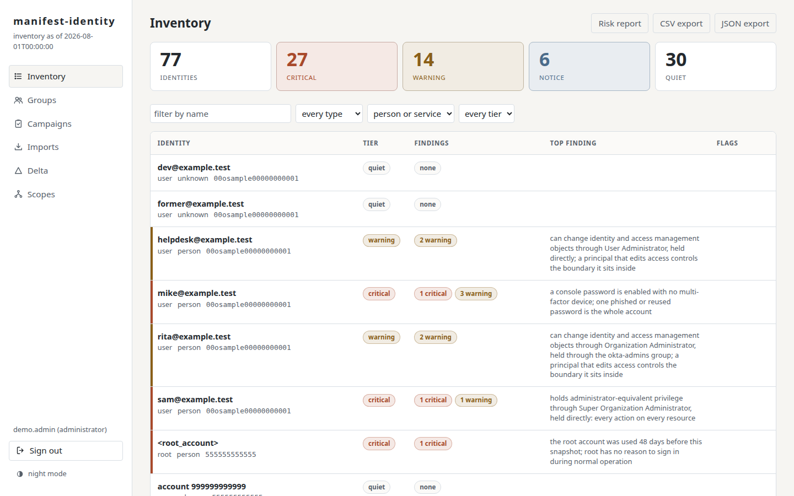
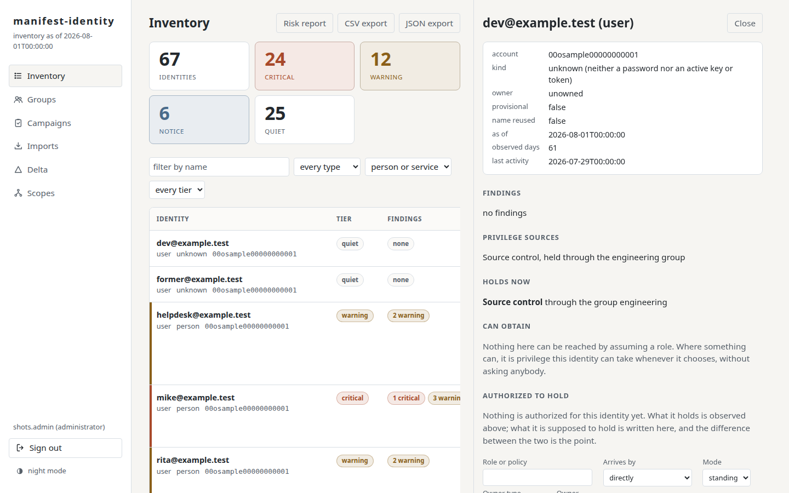
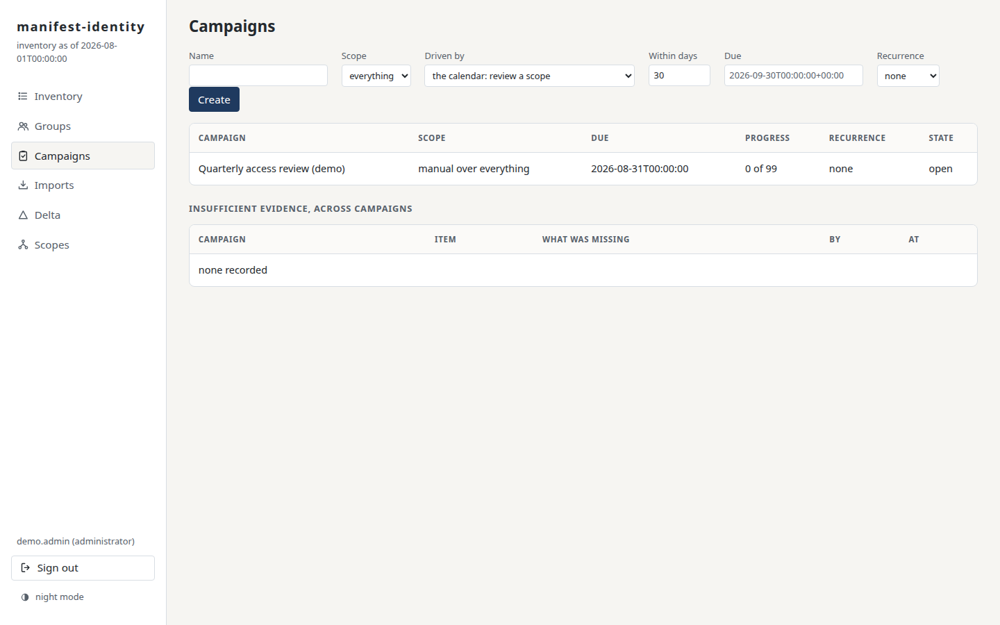
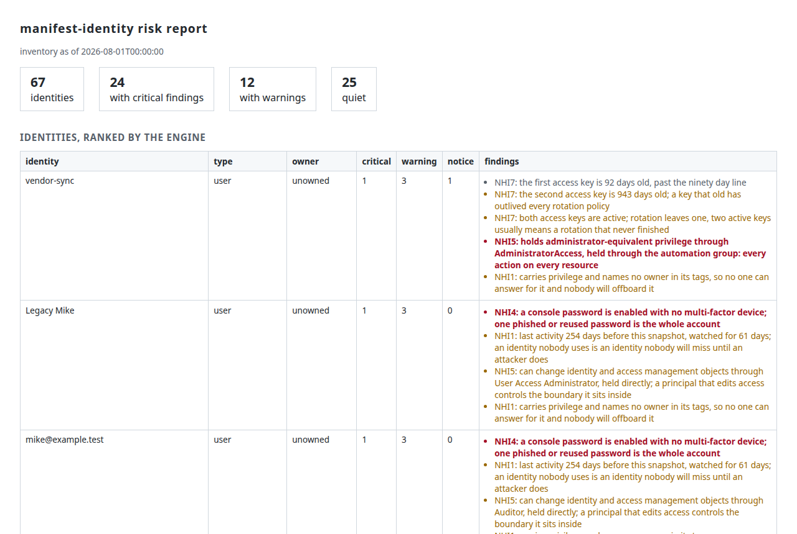
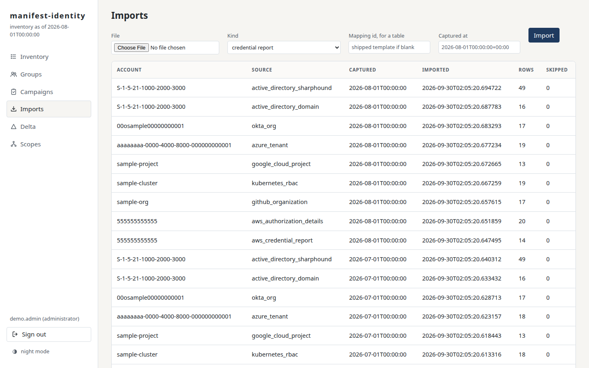
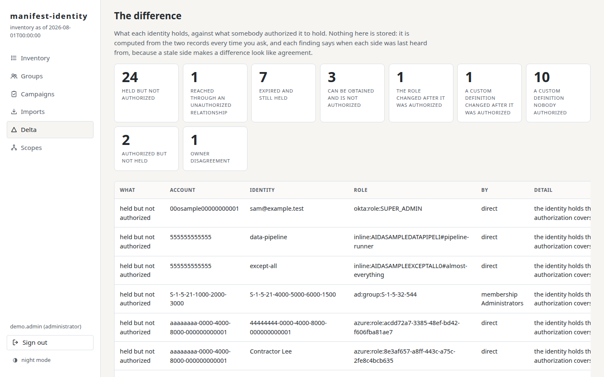
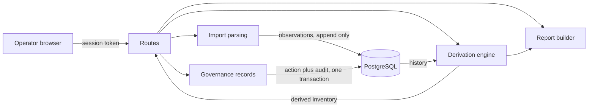

[](https://scorecard.dev/viewer/?uri=github.com/manifest-identity/manifest-identity)
[](https://www.bestpractices.dev/projects/14563)
[](https://github.com/tltaylor1/build-doctrine/blob/main/SCORES.md)
[](https://codecov.io/gh/manifest-identity/manifest-identity)
[](https://sonarcloud.io/summary/new_code?id=manifest-identity_manifest-identity)

**Documentation site**, this document with side navigation and search:
<https://manifest-identity.github.io/manifest-identity/>. What each badge above
measures and every item it scored: [SCORING.md](SCORING.md).

**Inventory and governance for non-human identities.**

manifest-identity is an application for reviewing who has access to
what across an organization's cloud accounts and directories.

- It provides a single source of truth, written by a named person, of
  what access each identity is allowed to have, with an owner and an
  expiry.
- It can import the records those systems already have and builds an
  inventory of every identity, the access each one holds, and
  enumerates the problems that follow, such as unused accounts, stale
  keys, and administrators nobody owns.
- It shows every difference between the two records and runs review
  campaigns that put each difference in front of the person
  responsible for it, one decision at a time.
- It never changes anything in the systems it reads.

It reads seven providers natively (Amazon Web Services, GitHub,
Kubernetes, Google Cloud, Azure and Entra, Okta, Active Directory)
and any other provider's table through a mapping, and it holds no
provider credential.

**If you run a cloud account, this happens to you.** Service accounts
get created for one integration, roles get broad policies so something
works, access keys get minted for a script whose writer has left. People
get onboarded and offboarded; these get created, granted, and forgotten.
The tools that track them store a status somebody set once, and a stored
status drifts the day after it is written. The result is the identity
nobody can explain: privileged, unused, unowned, and invisible until the
day it is abused.

**How it works**

1. Export what each provider already produces (an AWS credential
   report and authorization details file, a kubectl dump, a document
   assembled from the GitHub, Google Cloud, Graph, Okta, or directory
   cmdlets' own objects, a SharpHound collection, or a spreadsheet
   through a mapping) and import it, oldest
   capture first. Every import is kept and none is ever edited.
2. Every identity's state is derived from the observed history at read
   time, so a re-import is harmless and nothing can drift: what it
   holds now, what it can obtain, through which group or trust, with
   which credentials, and the findings that follow.
3. A person authorizes what an identity may hold: one grant path, an
   owner, an expiry, a reason, with the approver taken from the session
   and never from a form. The same door reads a spreadsheet of existing
   approvals through a mapping.
4. The delta is computed every time you ask and stored nowhere. Review
   campaigns, driven by the calendar, by the delta, or by expiry, put
   each difference in front of the person who can answer it, one
   decision per item, with an export that proves how the review was
   done.

**What it looks at.** Twenty findings, each one named, explained, and
anchored to the OWASP Non-Human Identities top ten:

- Root account use, a console password without MFA, an access key past
  its age, two live keys, a legacy certificate, an identity nobody uses.
- Administrator-equivalent privilege by capability rather than name,
  wildcard grants, everything-except grants, broad read, the ability
  to change IAM, privilege escalation paths.
- Trust policies open to the public or to another account.
- Privileged identities and groups with no owner, an owner tag that
  disagrees with the assigned owner, membership drift, an empty
  privileged group.

And beside the findings, nine classes of difference between the two
records: held but not authorized, authorized but not held, expired and
still held, eligible but not authorized, access through a door nobody
authorized, a definition that changed after it was authorized, a
custom definition nobody authorized, a custom definition that changed,
and an owner the tag and the record disagree about.

**People decide and the machine never does.** The engine recommends
and always names its reasons. It does not grant, revoke, or certify on
its own judgment, and every action traces to the person who decided it.

**Who it is for.** A team of one to a few people responsible for
identities across one or several providers, who need to answer "who
owns this, is it still needed, and did anyone say it should exist" and
prove they asked. It is not a provisioning tool and it does not change
anything in any provider.

manifest-identity is one application inside
[control-plane](https://tltaylor1.github.io/control-plane/), a security engineering
program built in public; the roadmap around this application, the
platform phases, and the program's own documents live there.

**The measured figures, each counted by a test:**

| Measured | Standing |
|---|---|
| Tests | **426 tests in 46 files**, coverage 95 over a 90 percent floor |
| Mutation | 34 controls removed by the check, 34 noticed by the suite |
| Surface | **70 routes**, every one in the role matrix the tests walk |
| Record | **87 recorded decisions**, each with its rejected alternatives |
| Gates | 11 required checks on every merge; releases carry provenance attestations |

The commands behind every figure are in
[The numbers, proven](#the-numbers-proven); a figure that drifts from
its count fails the build.



**Quick start**, with Docker as the only requirement:

```bash
git clone https://github.com/manifest-identity/manifest-identity.git && cd manifest-identity
cp .env.example .env   # fill in the four values it names
docker compose up -d
```

Then one command populates it end to end: the seven sample estates
imported, the authorized record written as an administrator would
have written it, and a review campaign open, safe to run twice:

```bash
docker compose exec app python -m manifest_identity.demo
```

Open http://127.0.0.1:8000, sign in with your administrator, and the
inventory is live; [Run it](#run-it) has the full path and the
reasons behind each step.

## Contents

The design lives in three files beside this one: [ARCHITECTURE.md](ARCHITECTURE.md), [THREAT-MODEL.md](THREAT-MODEL.md), and [ROADMAP.md](ROADMAP.md).

- [Status](#status)
- [What this is](#what-this-is)
- [Run it](#run-it)
- [Running it on Kubernetes](#running-it-on-kubernetes)
- [Using it](#using-it)
- [Every provider's file](#every-providers-file)
- [How a request is protected](#how-a-request-is-protected)
- [What runs where](#what-runs-where)
- [How it is put together](#how-it-is-put-together)
- [What it defends against](#what-it-defends-against)
- [Compliance traceability](#compliance-traceability)
- [Operating it](#operating-it)
- [How it was built and gated](#how-it-was-built-and-gated)
- [The numbers, proven](#the-numbers-proven)
- [What comes next, and what never will](#what-comes-next-and-what-never-will)
- [What done means here](#what-done-means-here)
- [Contributing](#contributing)
- [Diagrams to draw](#diagrams-to-draw)
- [Where to read next](#where-to-read-next)
- [Acknowledgements](#acknowledgements)
- [License](#license)

-------------------------------------------------------------------------------

## Status

**Version 0.5.0 is the whole application as planned, and the first
release since the repository stood alone.** The observed half was
built in twelve review-gated subphases whose order was fixed before
any code ([the plan](#the-plan-fixed-before-code)) and tagged v0.2.0
in August, with build provenance attestations on every release
artifact. The authorized half followed in sixteen more: the scope
tree, the authorization record and its two doors, paths and
relationships, versioned definitions, the delta, campaigns rewired,
alerts, the read API, the table door, six more providers, the page,
Active Directory through two doors, and the populated record a fresh
clone gets from one script. A fresh clone with Docker starts the
stack, migrates the schema, serves sign-in with three roles behind a
tested role matrix, imports identity exports append-only, derives the
inventory with its findings, keeps the authorized record beside it,
and produces the delta, the campaigns, the risk report, and the
escaped exports. The same digest-built image runs on a hardened local
Kubernetes cluster: default-deny network policies with three named
flows, the restricted pod security standard, an admission policy
refusing unpinned images, and workload identities with nothing to
steal; every claim has its probe in
[Running it on Kubernetes](#running-it-on-kubernetes). Next is v0.6,
the read-only provider connection, in the [roadmap](ROADMAP.md); the
platform this deploys to is built as code in
[control-plane](https://tltaylor1.github.io/control-plane/).

This is a learning project, built in public, by one person. The
software is provided as is under the
[AGPL 3.0 license](LICENSE). Before relying on any of it, read the
code and the [threat model](#what-it-defends-against), including its
accepted risks. Nothing here is production software until the
documents say so.

-------------------------------------------------------------------------------

## What this is

You feed manifest-identity the export files your providers already
produce: a record of every identity in an account, an organization, a
cluster, a project, or a tenant at one moment. It keeps every import
and never edits an old one. When you open the inventory, it works out
each identity's situation at that moment: compare the newest import
with the history, add what people have recorded, and show the result.
No status is ever stored, so no status can go stale or be quietly
changed; the answer is recomputed from the evidence every time you ask.

Beside that observed record it keeps a second one that no export can
supply: what each identity is supposed to hold, said by a named person,
for a period, with an owner. The difference between the two records is
what the product exists to show, and the review campaigns exist to put
each difference in front of the person who can answer it.

People supply what the files cannot: who owns this identity, which one
is suspicious, which one was reviewed and found fine, which access was
meant. Each of those records is saved with who said it and when, and
the same database action that saves it also writes the audit line, so
a decision cannot exist without its record. Reports and exports come
from the same computation the screen shows, so they cannot disagree
with it. And in version one the tool never connects to any provider:
files come in, reports go out, and nothing else moves.

### What it does

Each feature in three lines: what it does, why it is built that way,
and what proves it.

- **Reads seven providers natively and any other through a table.**
  AWS from its two export files, GitHub, Google Cloud, Azure and Entra,
  and Okta from one document each assembled from the provider's own API
  objects, Kubernetes from one kubectl dump, Active Directory from a
  document of the directory cmdlets' objects or from the SharpHound
  collector's zip, which adds who can obtain what through a control
  right; every other provider from a
  spreadsheet of who holds what, read through a mapping of its own
  columns. Each provider's vocabulary ends at its parser and the rest of
  the product never learns it, so the seventh provider is a parser and
  not a rewrite (D-071, D-076, D-079 to D-084). Proven by one test file
  per provider and a generated sample estate for each, imported by the
  demo.
- **Derives every identity's state at read time.** Owner, last use,
  second factor, what it holds now and what it can obtain, through
  which group or trust, and the findings that follow, computed from
  the whole history every time. Its credentials are read in nine kinds
  (access key, password, certificate, signing certificate, client
  secret, token, SSH key, Kerberos key, API key), each with its age
  and last use, and each identity is classified from their shape as a
  person, a service, a workload, an application, a group, a role, an
  external identity, or unknown (D-056). Nothing derived is stored, so
  nothing can drift or be edited (D-006). Proven by the derivation and
  finding suites and by the sample estates producing every finding.
- **Twenty findings, each with its reason.** Administrator equivalence
  judged by capability rather than name, escalation paths, keys past
  their age, identities nobody uses, trusts open to the world, groups
  nobody owns. Each names the rule it applied and the evidence, because
  a finding a reviewer cannot check is a rumor. Proven by
  `test_findings.py` and `test_privilege.py`.
- **Access as it actually arrives.** A grant records its route, hop by
  hop, through a membership, a trust, a delegation, and its mode:
  standing, eligible, or session. The page separates what an identity
  holds now from what it can obtain, which is what makes just-in-time
  access reviewable rather than invisible (1.6). Proven by
  `test_paths.py`.
- **Relationships and definitions as things to authorize.** A trust
  into a role is a door someone can authorize; a custom policy or role
  is a definition someone can authorize at a version, and one that
  changes afterwards names what it gained (1.6, 1.7). Proven by
  `test_delta.py` and `test_role_definitions.py`.
- **The authorization record.** What an identity may hold, written by
  a named person from the session and never from a form, with an owner
  who is never a lone individual, an expiry the clock enforces with no
  job, and a reason; append-only, superseded rather than edited,
  revoked with a reason rather than deleted (D-073). Proven by
  `test_authorizations.py` and the matrix walk.
- **Two doors into that record.** A form that prefills from what is
  observed, and a file door that reads an organization's own
  spreadsheet of approvals through a mapping of its columns, with a dry
  run that shows how the system read it before anything is written
  (D-074). Proven by `test_csv_import.py` and `test_from_observed.py`.
- **The delta, stored nowhere.** Nine classes of difference between
  held and authorized, each carrying the time each side was last heard
  from, because a stale side makes a difference look like agreement.
  Proven by `test_delta.py` and the mutation that removes the central
  comparison.
- **Review campaigns driven by the calendar, the delta, or expiry.** A
  frozen population, one decision per item with no bulk certification,
  recommendations with their reasons, the changes since the last
  certification, insufficient evidence as a recorded outcome, and an
  evidence export with the audit chain's head in it (D-039, 1.8).
  Proven by `test_campaigns.py`.
- **Alerts that are records first.** A revocation recommended, an
  authorization approaching expiry, a difference for an owner to
  answer: each recorded, each delivery recorded per recipient, sent
  through one interface that records rather than sends until a
  provider is chosen, a failed delivery recorded as failed (1.9).
  Proven by `test_alerts.py`.
- **A read-only API under integration tokens.** Identities from a
  cursor, the delta, and a change feed over the audit record, so a
  ticketing or monitoring system follows decisions as they happen;
  tokens are minted once, revocable, and budgeted each (1.10). Proven
  by `test_api.py`.
- **Governance on identities and groups.** Owners, purposes, flags, and
  attestations, attributed and audited, clearable, with an assigned
  owner answering the unowned finding and a disagreement with the
  provider's tag surfaced (D-019). Proven by `test_governance.py`.
- **Scoped authority.** A user holds a role at a place in the provider
  tree and can act on that place and everything beneath it, so an
  operator for one account is not an operator for another (D-072).
  Proven by `test_scope.py` and the mutation that widens the check.
- **A page proven by use.** One document, no build step, every value
  rendered as text under a content policy that forbids inline script;
  the detail opens beside the list, every list has a skeleton and an
  empty state, both themes pass a contrast check computed from the
  stylesheet's own tokens, and a real browser drives it in the
  pipeline (D-036, D-075, D-077). Proven by `test_frontend.py` and
  `test_browser.py`.
- **Reports and exports that cannot disagree with the screen.** The
  self-contained risk report, CSV and JSON with the spreadsheet exit
  neutralized, and the per-campaign evidence export, all from the same
  computation the page shows (D-040). Proven by `test_reports.py`.
- **Sample estates, generated and checked.** One per native provider,
  three months each, built to trigger every finding and every class of
  difference, regenerated by a test so the shipped files and the
  generator cannot drift; nothing about anyone's real estate is ever
  published. Proven by `test_sample_data.py`.
- **A demo that shows the day after.** The demo command writes the
  authorized record the way an administrator would have, through the
  same doors, so the delta shows every class of difference with
  believable counts and the campaign carries a mix of recommendations
  (D-085). Proven by `test_demo.py`, which also holds that a second
  run writes nothing.

### What it is not

Stated as firmly as what it is, so the tool is not asked to be
something else:

- Not a provisioning tool. It never grants, revokes, or writes
  anything to any provider; a revocation it recommends becomes a work
  item for a person (D-024).
- Not a connector. In version one it holds no provider credential and
  never connects; files come in and reports go out.
- Not a secrets manager, an identity provider, a security information
  and event management system, or a ticket system. It feeds all of
  them through its exports and its read API, and it replaces none of
  them.
- Not a judge. It recommends with its reasons and a named person
  decides, every time.

-------------------------------------------------------------------------------

## Run it

**Try it in one command.** With Docker installed, this brings up the
stack, writes an environment file with generated secrets if none
exists, imports the seven sample estates, writes the authorized
record, opens a review campaign, and prints the sign-in once:

```bash
./scripts/try.sh
```

Everything below is the same path taken by hand.

**Coming from a role-call checkout:** the variables in `.env` are
`MANIFEST_IDENTITY_*` (see `.env.example`), the database and its roles
are `manifest_identity` and `manifest_identity_app`, and an existing
data volume does not carry over: run `docker compose down -v` and
start fresh, or restore a backup under the new role names using the
procedure below (D-064).


Requires Docker with the compose plugin, and nothing else.

```
cp .env.example .env
# set POSTGRES_PASSWORD and MANIFEST_IDENTITY_APP_DB_PASSWORD (D-051), and set
# MANIFEST_IDENTITY_ADMIN_USERNAME and MANIFEST_IDENTITY_ADMIN_PASSWORD so startup
# creates your administrator
docker compose up --build
```

Three deliberate behaviors sit behind that block. The compose file
refuses to start while a key is missing, because the tempting
alternative, a hardcoded default, becomes the production secret the
day someone forgets to set the real one; failing at startup is loud
where a default is silent. A separate migration step runs first, as
the database's owner role, and a failed migration stops the start
rather than letting anything serve against a schema it does not
understand; the application's own role holds data rights only
(D-013), so the serving container could not change the schema even
through an injection flaw the ORM has no path for. And the
image build installs the dependency tree by cryptographic hash, so a
package that differs from the reviewed one, from any source, for any
reason, fails to install instead of running.

Open http://127.0.0.1:8000 and sign in with the administrator from
your .env. No password or secret is written anywhere in this
repository; you create all of them locally.

Then import the sample estate that ships in
[sample-data](sample-data): three import generations of seven
estates, an AWS account in both file formats, a GitHub organization,
a Kubernetes cluster, a Google Cloud project, an Azure tenant, an Okta
organization, and an Active Directory domain through both of its
doors, the capture time in each file's name, plus one
table per recipe for the door. Import them oldest first from the
Imports view, because state is derived from history and the history
should arrive in the order it happened; then read the inventory.

The sample account is synthetic and deterministic, generated by
`python -m manifest_identity.sample_data`, and it is built to trigger every
finding the engine can produce, including the ones that need history:
an identity that stops being used, a group that gains a member, and a
name that comes back under a new identifier. It is generated rather
than typed because hand-typed demo data was wrong three times in three
subphases before this became a rule; a test regenerates it and fails
if the shipped files and the generator disagree.

The committed account stays small on purpose: one identity per
archetype, so every finding is readable. For load work the same
generator scales: `python -m manifest_identity.sample_data out --scale 1000`
adds a thousand bulk identities to each generation, one third people
with passwords and two thirds services with keys, every variation
derived from the identity's index so the output is byte-identical on
every run. Scaled sets ship as release artifacts, never as commits.

**Without Docker.** Requires Python 3.11 or newer; developed and
tested on 3.14, and the whole suite runs against 3.11 in the
pipeline so the floor is held by execution, not assertion. SQLite
serves a local look; PostgreSQL is what the compose file runs.

```
python3 -m venv .venv && .venv/bin/pip install -r requirements.txt
export MANIFEST_IDENTITY_DATABASE_URL="sqlite+pysqlite:///rc.db"
export MANIFEST_IDENTITY_ADMIN_USERNAME=admin MANIFEST_IDENTITY_ADMIN_PASSWORD=<yours>
.venv/bin/python -m manifest_identity.demo
.venv/bin/uvicorn manifest_identity.main:app
```

The demo command migrates, creates the administrator from the
environment, imports the shipped sample months oldest first, writes
the authorized record as an operator it creates (most of what is held
authorized, with an owner and an expiry, and a few cases planted so
every class of difference shows), and opens one review campaign; it
converges when run again, so it is safe to repeat (D-085). To prepare an empty instance instead, replace it
with `.venv/bin/alembic upgrade head`.

To stop the compose stack, `docker compose down`; add `-v` to also
delete the database and start clean. The care of a running instance is in
[Backup, restore, and retention](#operating-it),
next.

## Troubleshooting

The ways a first run most often looks broken when it is not, each
from a real session:

- **A rebuild changed nothing on screen.** The browser is serving the
  previous stylesheet and script from its cache. Hard-refresh the tab
  (Ctrl+Shift+R) after any `docker compose up --build`; the served
  files are current, the tab is not.
- **The demo command exits with code 1 and a message about admin
  variables.** It refuses to run without `MANIFEST_IDENTITY_ADMIN_USERNAME` and
  `MANIFEST_IDENTITY_ADMIN_PASSWORD` set, on purpose, so no clone ever carries a
  default account. Set both in `.env` and run it again.
- **The app container starts and then exits.** The database password
  split (D-051) means `MANIFEST_IDENTITY_APP_DB_PASSWORD` must be present in
  `.env` alongside `POSTGRES_PASSWORD`; a missing one fails the
  migration step before the server starts. `docker compose logs
  migrate` names which.
- **Port 8000 is already taken.** Another instance, often a forgotten
  `uvicorn`, holds it. `ss -ltnp | grep 8000` names the process; stop
  it or change the published port in the compose file.
- **Sign-in fails right after a fresh start.** The admin user is
  created by the bootstrap on first start from the same two variables;
  if they changed after the first run, the stored user did not. Reset
  with the database-delete step above, or create the user through the
  admin routes.
- **The container job fails on a scheduled run when nothing changed.**
  Debian shipped a fix for a package in the pinned base image, and the
  scan blocks until the digest moves. Pull the tag named in the
  Dockerfile's comment, read its manifest digest from the registry,
  and move it in the Dockerfile and the workflow twin in one commit;
  the parity check refuses either alone. If upstream has not rebuilt
  yet, the built image already carries the fix through its own
  update step, and only the base row stays red until it has.

-------------------------------------------------------------------------------

## Running it on Kubernetes

The same image, the second runtime. Docker Compose trusts its files;
Kubernetes refuses at a gate what a file forgot, and this deployment
exists to make those refusals real on a laptop before any cloud is
involved.


```
scripts/cluster-up.sh
export POSTGRES_PASSWORD=... MANIFEST_IDENTITY_APP_DB_PASSWORD=... MANIFEST_IDENTITY_ADMIN_USERNAME=... MANIFEST_IDENTITY_ADMIN_PASSWORD=...
scripts/deploy-app.sh
```

The first script fetches kind and kubectl from their canonical
releases, verifies their checksums, and brings up a cluster on a
digest-pinned node image with Calico installed from a vendored,
digest-verified manifest; the default network plugin is disabled
because it ignores network policies silently. The second builds the
image, loads it into the cluster so no registry is ever consulted,
creates the secrets from your environment, refusing to run while one
is missing, and waits for readiness. The page is at
http://127.0.0.1:8000, published on the loopback interface only,
matching the compose posture. `scripts/cluster-down.sh` removes it
all.

What the cluster enforces that compose cannot, each verifiable:

- **Network policy, default deny.** Everything is refused except the
  three flows the system has: operator to application, application to
  database, and name resolution. Calico enforces; the probes prove:

```bash
.tools/kubectl -n manifest-identity exec deploy/app -- python -c "import socket; socket.create_connection(('db', 5432), timeout=5); print('allowed')"
.tools/kubectl -n manifest-identity run probe --image=postgres@sha256:4ef4dbc939d61acea57712655ddb4b4ab27419c913f94cca0cd57cb3ea3c2280 --restart=Never --command -- sleep 300
.tools/kubectl -n manifest-identity exec probe -- timeout 4 bash -c "echo > /dev/tcp/db/5432"   # hangs and dies: denied
```

- **Admission, two layers.** The namespace enforces the restricted Pod
  Security Standard, and a validating admission policy refuses any
  image not pinned by digest, with the locally built application image
  as the one recorded exception (D-047). A privileged pod and an
  unpinned image are both refused at creation, wording and all:

```bash
.tools/kubectl -n manifest-identity run unpinned --image=nginx:latest --restart=Never   # refused by the image-pinning admission policy (D-047)
```

- **No orchestrator identity to steal.** The workloads run under
  service accounts with no permissions and no mounted token, because
  the application needs nothing from the Kubernetes API:

```bash
.tools/kubectl -n manifest-identity exec deploy/app -- ls /var/run/secrets/kubernetes.io   # No such file or directory
```

The manifests are schema-validated and posture-linted in the pipeline
by kubeconform and kube-linter, both fetched checksum-verified like
every other tool.

-------------------------------------------------------------------------------

## Using it

The pages, from a running instance with the sample account imported
(captured by [scripts/capture_screenshots.py](scripts/capture_screenshots.py),
so these images are reproducible rather than asserted):







The page is one document with no build step (D-036, D-075, D-077).
The views sit in a sidebar, the theme follows the system until a
person chooses one from the bottom of that sidebar, every row that
opens something can be reached and opened from the keyboard, and the
palette is a set of tokens whose contrast a script checks in both
themes. An identity opens beside the list it came from rather than on
top of it, every list stands a skeleton while it loads and says what
to do next when it is empty, and the delta's tiles narrow the table to
one class of difference.

Four people, and the design answers their questions in their order.

- **The reviewer** certifies identities and groups: what is this,
  whose is it, what can it do and where did that privilege come from,
  is it used, what changed since last time, what do you recommend.
  Everything on the decision screen exists to answer those without
  leaving the page, and when the answer is not there, "insufficient
  evidence, here is what was missing" is a recorded outcome that
  steers what gets built next.
- **The operator** imports files, runs campaigns, and triages
  findings.
- **The auditor** consumes proof: the population statement, coverage,
  each decision with its actor and time.
- **The administrator** manages users and roles, and nothing else.

Three roles. A reviewer reads everything and records attestations and
review decisions. An operator additionally imports files and sets
governance: owners, purposes, flags. An administrator additionally
manages the application's local users.

**Imports.** Nine file shapes are read natively, the two AWS export
formats, one document each for GitHub, Kubernetes, Google Cloud,
Azure and Entra, and Okta, and two for Active Directory, the cmdlet
document and the SharpHound collection; a tenth, the table, carries
any other provider through a mapping; the Imports view names the shape
and a file of another shape is refused rather than guessed. Every
parser works in memory, bounded on every axis, and never writes to
disk. The file's content is authoritative and its name is not,
because a filename is client input; a file claiming to cover one
account, cluster, project, tenant, organization, or domain is
verified to cover one rather than trusted; a timestamp with an unrecognized timezone is rejected
rather than guessed, because capture times order the history and
therefore decide what counts as current. Imports are append-only and
duplicates are rejected, so a re-import is harmless and out-of-order
syncs self-correct.



**Inventory.** The dashboard counts identities by their worst finding
tier; the table filters by name, type, and tier, and each row shows
its worst finding explaining itself, so the list teaches before a
single click. Nothing here is a
stored status: every figure is computed at read time from the
observation history, because a stored security status that drifts
from reality is worse than none, people trust it. The computation
runs against the newest import's capture time, never the wall
clock, so a month-old import shows month-old staleness rather than
aging by itself, and the as-of line states what the page knows. Hiding an identity from
this inventory requires tampering with the stored history again after
every future sync, because each sync is a full picture and state is
re-derived from all of it.

**Identity detail.** The observation timeline, the findings, and the
governance section. Identities are keyed by the provider's immutable
identifier, not by name, so a principal deleted and recreated under
its old name is a new identity that inherits nothing, and the reuse
of a governed name is itself surfaced, because inheriting a dead
identity's standing is exactly how a recreated principal would be
laundered. An identity is not flaggable as unused until it has been
observed for fourteen days, because a two-week-old key that has not
been used yet is new, not stale, and a false positive on day one
costs the tool its credibility.

Findings explain themselves and name their sources: which policy,
held directly or through which group. Privilege is judged by what a
policy can do, not what it is called, so a policy named ReadOnly that
grants the permission to attach arbitrary policies is reported as the
administrator it is. Escalation detection covers the published
single-permission and permission-pair paths a principal could use to
raise its own privilege, and reports them for principals nobody calls
an administrator, because the shadow admin is the finding that
matters; the actual administrators are already on somebody's list.

The governance section holds the human record: a typed owner, a
purpose, flags, and attestations, each attributed, each superseded or
cleared rather than edited, so the history of who said what stands
the way the machine history does. The owner is a team by default,
because an individual owner is the orphan in waiting: the person
leaves, nothing in the cloud account changes, and the identity keeps
its keys with nobody accountable, which is the failure class this
tool opens with. Assigning an owner answers the unowned finding; a
disagreement between the assigned owner and the provider's tag is
surfaced as its own notice naming both values, because a silent
winner would hide exactly the staleness a governance tool exists to
show.

**Authorizations.** Beneath the observed facts, the detail shows the
second record: what a named person said this identity may hold, for
how long, and who owns it, beside what it holds now and what it can
obtain, each grant with the route it arrives by (directly, through a
group, by assuming a role, or, in a directory, through a control
right). The authorization form prefills from an observed grant, so
authorizing what exists is one confirmation and not a transcription;
the approver is taken from the session and never from a field, and
an authorization is superseded or revoked with a reason rather than
edited, so the record of who allowed what stands the way the machine
history does. An organization that already keeps its approvals in a
spreadsheet imports them through the file door, with a dry run that
shows how each row was read before anything is written.

**The delta.** One view of every difference between the two records,
in nine classes: held but not authorized, authorized but not held,
expired and still held, eligible but not authorized, reached through
a door nobody authorized, a definition that changed after it was
authorized, a custom definition nobody authorized, a custom
definition that changed, and an owner the tag and the record disagree
about. Each row names both sides and when each side was last heard
from, because a stale side makes a difference look like agreement.
The tiles at the top count each class and narrow the list; the view
is computed every time it opens and stored nowhere, so it cannot say
yesterday's answer.



**Groups.** Privilege sources with members, owners, and their own
findings. An empty privileged group is reported before anyone joins
it, because it is a standing grant waiting for its next member with
nobody reviewing it. What changed since the previous import,
who joined and who left, is computed and shown, because the delta is
what a review actually reviews; re-reading the full list every
quarter produces approval without attention.

**Campaigns.** A campaign is driven by one of three things: the
calendar, which reviews a scope and stays because auditors ask for it;
the delta, which puts every identity with a finding a person must
answer in front of whoever can say whether the access should exist; or
expiry, which puts every authorization ending within a window in front
of the person who approved it, and raises an alert for each so an
expiry nobody heard about cannot become one still held. Whatever
drives it, a campaign freezes its population into items at creation,
each item carrying the evidence as it stood and the engine's
recommendation with its reasons, so the review covers a stated
population rather than a moving one; the population statement in the
evidence export describes that frozen set, which is what makes it a
statement instead of a target. Decisions are one item, one person:
certify, revoke recommended, insufficient evidence, or delegated.
There is no bulk certification anywhere in the application, because a
certification records that someone looked at that identity, and a
button that certifies a hundred rows at once records that nobody did.
Insufficient evidence must name what was missing and delegation must
name who holds it now, because those answers are meaningless without
their notes; the rollup collects the missing-evidence notes across
campaigns, since one recurring note is a reviewer's problem and the
same note across a column is the program's problem. A decision is
final within its campaign, a changed mind being the next campaign's
decision, and close refuses while any item is unanswered, because an
access review with gaps is a false population statement. The evidence
export carries the population statement, coverage, and every decision
with actor and time, as JSON and as a CSV built from the same export,
because the people who consume evidence live in spreadsheets.

**Reports.** The risk report is one self-contained file ranked by the
engine, safe to open from disk years later. Because it opens from
disk, no server header protects it, so it is rendered by an engine
that escapes every value by default and contains no script element at
all. The CSV prefixes every formula-leading cell, because a cell that
begins with an equals sign executes in the reader's spreadsheet with
the reader's permissions, and identity names are controlled by the
observed account's users. The JSON export carries the same figures the
page shows, raw, because JSON consumers parse rather than interpret.
All three read from the one computation the page reads.

**The page itself** renders every API value through its text
interface, never as markup, so a hostile identity name displays as a
string instead of running as script; a parser-based scan of the page's
code fails the build if a markup sink appears. The session token lives
in a closure variable rather than browser storage, where any script
that ever ran in the page could read it; the accepted cost is that a
refresh signs you out. The content policy forbids inline script and
style, and the page needs neither.

-------------------------------------------------------------------------------

## Every provider's file

Seven providers are read natively: AWS through its two export
formats, GitHub through the assembled organization export (D-076),
Kubernetes through the cluster's own dump (D-079), Google Cloud
through a document of gcloud's own answers (D-080), Azure and Entra
through a document of Graph's objects and the command line's output
(D-081), Okta through a document of the management API's objects
(D-082), and Active Directory through two doors, a document of the
directory cmdlets' objects (D-083) and the SharpHound collector's zip
(D-084), the second carrying the control rights that say who can
obtain what without being a member. Every other provider
on the list enters through the table door (D-074, D-078): a file of who holds what, read through a mapping, with the
shipped template's columns as the default. A provider through the door
gets the inventory, the authorization record, the delta, and campaigns
the same day; what it does not get until it earns a parser of its own
is credentials and their ages, second-factor state, activity, trust
relationships, and the contents of a role definition, which is what the
privilege findings read.

The recipes under [recipes/](recipes) turn each provider's own export
into the door's table, and a sample table per provider ships in
[sample-data](sample-data) so each can be tried at once. The jq
recipes run in the test suite against inputs in the provider's
documented shape, so a recipe that stops producing the table fails the
build; the PowerShell and SQL recipes are documented and shipped, and
their sample tables are the tested half.

| Provider | The provider's own export | Recipe | Sample table |
|---|---|---|---|
| Kubernetes | Read natively (D-079): `kubectl get roles,clusterroles,rolebindings,clusterrolebindings,serviceaccounts -A -o json` through `POST /imports/kubernetes-rbac`, the cluster's name given beside the file | `recipes/kubernetes.jq` remains for the table door | `observed-kubernetes.csv` and the three `kubernetes-rbac.json` months |
| Google Cloud | Read natively (D-080): one document holding `gcloud projects describe`, `get-iam-policy`, `iam service-accounts list`, and `keys list` outputs verbatim, through `POST /imports/google-cloud` | `recipes/google-cloud.jq` remains for the table door | `observed-gcp.csv` and the three `google-cloud.json` months |
| Azure and Entra | Read natively (D-081): one document holding Graph's users, groups, service principals, directory roles, and eligibilities with each subscription's `az role assignment list` output, through `POST /imports/azure-tenant` | `recipes/azure.jq` remains for the table door | `observed-azure.csv` and the three `azure-tenant.json` months |
| Okta | Read natively (D-082): one document holding the management API's users, groups, role assignments, custom roles, and applications with their assignments, through `POST /imports/okta-org` | `recipes/okta.jq` remains for the table door | `observed-okta.csv` and the three `okta-org.json` months |
| Active Directory | Read natively (D-083, D-084): one document of `Get-ADDomain`, `Get-ADUser`, `Get-ADGroup` with `Get-ADGroupMember`, `Get-ADComputer`, and `Get-ADTrust` outputs through `POST /imports/active-directory`, or the SharpHound collector's zip through `POST /imports/sharphound` | `recipes/active-directory.ps1` remains for the table door | `observed-active-directory.csv`, the three `active-directory.json` months, and the three `sharphound.json` months |
| Database (PostgreSQL) | `pg_roles` and `pg_auth_members`, read by the script | `psql -v instance=NAME -f recipes/database.sql` | `observed-database.csv` |
| SaaS, generic | Whatever table the system exports | A mapping of its own columns | the shipped template |

What a recipe cannot carry is stated in its header. A Kubernetes
group is a name the cluster cannot list the members of, so it enters
as a group with no members; a Google Cloud binding's condition is not
read; an Azure assignment at a resource group is filed under its
subscription, and Entra directory roles and eligibilities are not in
the command's output; an Okta role that arrives through a group
records the hop without the group's name; a directory account's
password age, last logon, service principal names, and control
rights stay behind. Each of those is what the native parser for that
provider carries, and every provider with a recipe except the
database has one.

-------------------------------------------------------------------------------

## How a request is protected

Three parts, with all security enforced in the middle one: a
PostgreSQL database reachable only by the application container, the
FastAPI backend where every rule lives, and one HTML page that holds
no security logic on purpose, because a browser page is fully under
its user's control and anything enforced there is decoration.

Every request to the backend passes the same gates in order, and each
gate exists because of a specific failure:

- **Session check.** Who is calling. The session token is an opaque
  random value, and the database stores only its SHA-256 digest, a
  one-way fingerprint: someone who reads the table holds nothing they
  can replay. Sessions are individually revocable and expire
  absolutely, because expiry without revocation means one stolen
  token can only be ended by logging everyone out, which in practice
  means nobody does it.
- **Two different refusals.** A missing or dead session gets 401, a
  valid session without the needed role gets 403 naming the roles
  that would be admitted. An authenticated caller deserves an answer
  they can act on, and separating no identity from insufficient
  authority costs an attacker nothing they could not learn anyway.
- **The role matrix.** May this role call this route. One data
  structure in [manifest_identity/core/roles.py](manifest_identity/core/roles.py) is the single
  answer: the route dependencies read it to enforce and the tests
  read it to verify, so the enforced matrix and the tested matrix
  cannot drift apart. A route missing from the matrix fails the
  build, and a typo in a matrix key crashes the process at startup
  rather than leaving a route unguarded.
- **The scope check.** May this caller act *here*. The matrix answers
  which roles a route admits; a write whose target belongs to a place
  in the estate asks a second question, answered by bindings at that
  node, at any node above it, or at the global node (D-072). An
  operator for one account holding the role the matrix admits is
  still refused on another account's identity, and the refusal says
  it is the scope, not the role. Authority is answered in one
  function so the tests can walk it and the mutation check can
  remove it and watch them fail.
- **Typed validation.** Is the request sane. Every body passes a
  typed model with bounds, and a rejected value is never echoed back,
  because an error message that repeats attacker input is a
reflection surface.
- **The action, through the ORM.** The object-relational mapper, the
  library that turns Python objects into parameterized database
  queries, is the only path to the database, which removes SQL
  injection, attacker text becoming database commands, as a class
  rather than defending it query by query.
- **The audit row, in the same transaction.** Any action that changes
  governance state commits together with its audit record, so neither
  can exist without the other. A best-effort trail was rejected
  because the gap between action and record is exactly where an
  investigation dies.
- **The response, through a declared model.** What a client may see
  is defined by schema, not by what the row happens to contain, so an
  internal field added next year does not leak by default.

In classic terms the gates implement authentication, access control,
and accounting; the design principle is that each is a mechanism that
runs, not a rule that hopes. This product reserves the word
authorization for the record of what an identity is allowed to hold
(D-073), and calls its own gates the role matrix and the scope
check.

Sign-in itself gets four defenses of its own. Passwords hash with
bcrypt, which salts automatically and is deliberately slow by an
adjustable work factor, turning a bulk password-cracking run from
hours into years. An unknown username pays the same bcrypt cost and
receives the identical response body as a wrong password, so neither
timing nor wording reveals which accounts exist. Failed attempts are
rate limited per username and per address, counting failures only,
with no account lockout, because a lockout hands any attacker who can
spell a username a denial of service against its owner. And the
attempted password never reaches a log; the log line records that a
failure happened, not what was typed.

### Trust boundaries

Three boundaries, in order of hostility:

1. **The imported file.** The only input the application
   accepts from outside, treated as hostile in every particular even
   though it nominally comes from a cloud provider's own reporting:
   bounded, parsed in memory, verified against its own claims, never
   echoed.
2. **The browser session.** Authenticated on every request; nothing
   about a session is trusted from one request to the next. Identity
   names, tags, and paths inside imported data are
   attacker-influenceable and are rendered as text, never markup,
   because the person most exposed to this data is the operator
   reading it.
3. **The exports.** Everything leaving the system passes an allowlist:
   the response models for the API, formula escaping for the
   spreadsheet forms, and deliberate field selection for the report,
   because the inventory is a map of the account's weakest identities
   and an export is that map on the move.

Version one has no outbound connection to any provider. The cloud
credential and its boundary arrive with the cloud phases and get their
own threat model revision first.

-------------------------------------------------------------------------------

## What runs where

Everything runs on your machine, and nothing leaves it. The inputs
are files you exported yourself from your own account; the outputs
are a page on loopback and the files you choose to download. Version
one holds no cloud credential of any kind, calls no external service,
and sends no telemetry, so there is no place a secret could leak to
and no third party to trust. The local Kubernetes variant keeps the
same property: the cluster is on your machine, and the admission,
network, and identity controls it adds apply inside it.

-------------------------------------------------------------------------------

## How it is put together

| Component | Job |
|---|---|
| Frontend | A single page served by the application; renders every value as text through the document interface with no markup sink, holds the session token in memory rather than browser storage, and runs under a content policy that forbids inline script and style (D-036). The look is tokens and a sidebar shell (D-075); the detail opens beside the list, every list has a skeleton and an empty state, and a real browser proves the page by use (D-077) |
| Routes | The trust boundary; authentication checked on every request, every response shaped by a declared model |
| Import parsing | Parses an imported identity export file, bounded on every axis, in memory, append-only |
| Derivation engine | Computes each identity's state and enrichment from the observation history at read time |
| Governance records | The human layer: owners, flags, attestations, written with attribution and an audit row in one transaction |
| Report builder | Produces the self-contained risk report and the escaped CSV and JSON exports |
| Audit trail | Records every governance action, written with the action in one transaction |
| PostgreSQL | Holds observations, governance records, and the audit trail; access controlled, with encryption at rest supplied by the deployment layer (D-020) |
| The tool's own cloud credential, not yet present | Version one holds none. The live pull phases add a read-only role in the target AWS account, and from that day it is the identity that must be governed best |



An import records observations and touches nothing else. A view
derives the inventory from the history and stores nothing. A
governance action is the only ordinary write besides ingestion, and it
commits with its audit row as one unit. The report builder consumes
the same derived inventory the view does, so a report can never
disagree with the screen.

### The data model shape

The model is provider-neutral: no table carries a word only one cloud
uses, and the provider's own vocabulary ends at the parser (D-071).

```
scope_nodes --< scope_nodes (the tree, global at the top)
scope_nodes --< imports --< identity_observations >-- identities
imports --< credentials >-- identities
imports --< grants >-- identities, role_definitions, scope_nodes
imports --< memberships >-- identities (groups are identities)
imports --< observed_relationships >-- identities
identities --< governance_records
identities --< authorizations >-- scope_nodes
users --< role_bindings >-- scope_nodes
campaigns --< campaign_items
alerts --< alert_deliveries
audit_events
```

- A **scope node** is one place in a provider's hierarchy: an
  organization, an account, a tenant, a subscription, a cluster. Each
  names its partition explicitly, commercial or government, so a
  government estate is labeled on every record rather than inferred.
  One synthetic node named **global** sits above all of them.
- An **identity** is one principal at one scope node, keyed by the
  provider's immutable identifier, never the name or ARN, which are
  display attributes (D-016). A recreated principal is a new identity.
  Groups are identities of kind group: governable sources of
  privilege, never actors (D-019).
- An **import** is one file or pull: one scope node, one source kind,
  one capture time taken from the file's own content (D-008), unique
  on that triple, so a re-import is rejected rather than
  double-counted.
- A **credential** is one credential as one import saw it. Two access
  keys are two rows and a provider with five is five rows, so nothing
  in the model assumes a cloud that offers exactly two.
- A **grant** is an identity holding a **role definition** at a scope,
  by a path and in a mode. The path records how the privilege arrives,
  hop by hop, through a membership or a trust; the mode records
  whether it is held now or can be obtained, which is what PIM-style
  eligibility is. A role definition is versioned by the hash of its
  contents, so a changed built-in role is a new row and a review can
  show what the role allowed on the day of the decision.
- A **role binding** is authority: a user holding a role at a scope
  node, covering that node and everything beneath it (D-072). Users
  carry no role column. A binding is revoked, never deleted, so the
  record of who could act when survives.
- An **authorization** is what a person said an identity may hold:
  one grant path, an owner, the authorizer taken from the session, a
  justification, and a window that ends (D-073). Nothing is edited. A
  renewal writes a new row that supersedes the old one and a
  revocation writes one too, so the chain from the first authorization
  to the last is the history. Expiry is the clock compared to a
  column, never a job that might not run. Which fields an
  authorization must carry is the administrator's choice, shipped
  strict, and every change to that choice is audited (D-070).
  Authorizations arrive through the form on an identity's page or
  through a file. A file
  keeps its own shape: the import carries a **mapping** that names
  which of their columns holds each field, or a constant for a field
  their file does not have, so nobody is asked to transform their
  spreadsheet before they get anything back (D-074). A mapping is
  written and superseded rather than edited, and every import names
  the mapping that read it, so a mapping later found wrong leaves
  every row it produced findable. Nothing is guessed: a missing
  required column refuses the file, a missing optional one is named
  in the result, unmapped columns are counted, and a date is read by
  a format the mapping declares, because 03/04/2026 is two different
  days in two countries. A dry run shows how the file was understood
  and writes nothing.
  Neither door asks anyone to retype what the system can already see.
  The observed grants come back in the authorized record's own shape,
  as a prefill on an identity's page and as an export in the import's
  columns, with the owner and the justification left empty because
  they are the two things the observed side cannot know. What already
  carries an authorization is marked, so the page asks where the
  answer is still owed. It prefills and never writes: turning what is
  into what should be without a person in the middle would leave the
  delta comparing the observed record against a copy of itself
  (D-024).
- The **delta** is the product, and it is stored nowhere. It is the
  difference between the two records, computed every time somebody
  asks, in nine classes: held but not authorized, reached through an
  unauthorized relationship, expired and still held, can be obtained
  and is not authorized, the role changed after it was authorized, a
  custom definition changed after it was authorized, a custom
  definition nobody authorized, authorized but not held, and owner
  disagreement. The two that read the route rather than the hold
  arrived with 1.6, because comparing what an identity holds against
  what was authorized cannot see access that arrives by assuming a
  role, or the door it arrives through. The two about a definition
  arrived with 1.7, because a custom policy is a thing somebody wrote
  and should own, and when it changes after it was agreed the finding
  names the actions that arrived rather than only saying it moved. Every finding carries when each side
  was last heard from, because a finding from a month-old import is
  true about a month-old world, and a stale side makes a difference
  look like agreement (threat 15).
- An **alert** is a record that people were told, and each delivery to
  each recipient is its own row with its result, so "nobody told me"
  is answerable either way. Alerts fire on an authorization written or
  revoked, an authorization entering its expiry window, and a
  revocation recommended by a review, which is the work item the tool
  produces because it never acts. Delivery sits behind one narrow
  interface; this release records and does not send, so the failure
  paths and the recipient bound are built and tested before any mail
  server is involved. A delivery that fails is recorded as failed and
  never breaks the action that raised it.
- An **integration token** opens a read-only surface under `/api/v1/`
  for a system rather than a person: identities paged from a cursor,
  the delta, and a change feed that walks the audit record from a
  cursor and returns the next one, so a consumer follows decisions as
  they happen rather than polling a full dump. A token is a second kind
  of credential, stored as a hash the way sessions are, shown once at
  minting and never again, revocable, and rate limited per token.
  Session routes refuse tokens and token routes refuse sessions. This
  surface is demonstration-grade: enough to show the shape, and not yet
  hardened for anyone to rely on, which is an open question the plan
  carries on purpose.
- **GitHub is the second native provider** (D-076): one document
  assembled from the REST API's own objects becomes the same neutral
  rows, with the organization and its repositories as scope nodes,
  teams as groups, outside collaborators as guests, app installations
  and deploy keys as identities of their own, and the fixed permission
  levels as provider-managed definitions whose contents say what the
  level can do in the terms the privilege reading already speaks. An
  organization owner, a repository admin, and an app that may write
  members read as administrator equivalent through the same finding as
  an AWS administrator policy.
- **Kubernetes is the third native provider** (D-079): the cluster's
  own dump becomes the same rows, with the cluster and its namespaces
  as scope nodes, service accounts as services, users and outside
  groups as identities the authenticator asserts, the cluster's own
  two groups with their members written, and every role's rules read
  as capabilities, so a role that can bind or escalate reads as
  changing access and a rule for every verb on every resource reads
  as administering. The rules ride as actions, so a changed custom
  role names what it gained.
- **Google Cloud is the fourth native provider** (D-080): a document
  of gcloud's own answers becomes the same rows, with the project as
  the scope node, service accounts keyed by the identifier the
  provider never reuses and their user-managed keys as credentials
  with ages, every member form a policy can write read (a group, a
  domain, the two public forms, a deleted principal a binding still
  names, a federated principal), and a role read from its permission
  list when the export carries one, from a table of the fixed roles
  otherwise, and from its name as the last resort.
- **Azure and Entra are the fifth native provider** (D-081): one
  document of Graph's objects and the command line's output becomes
  the same rows, with the tenant, its subscriptions, and their
  resource groups as scope nodes, members with a password whose second
  factor state the registration report answers, guests from another
  tenant, service principals with their secrets and certificates as
  credentials that expire, groups passing their members up, directory
  roles held standing by members and in the eligible mode by
  privileged identity management, and Azure roles read from their
  actions or their names. An eligibility is what an identity can
  obtain and is never counted as privilege held.
- **Active Directory is the seventh native provider, with two doors**
  (D-083, D-084): a document of the directory cmdlets' objects or the
  SharpHound collector's zip becomes the same rows, with the domain
  as the scope node keyed by its identifier and every organizational
  unit beneath it, a password per user active while the account is
  enabled, a Kerberos key beside it for an account with a service
  principal name, computers as workloads with their machine accounts,
  groups flattened through every level of nesting with the holding
  group named, the built-in groups that hold the domain read from a
  table of what each may do, a member from another domain as an
  external identity, a trust as a relationship, and, from the
  collector alone, a control right on the domain or on a privileged
  group or one of its members as access the principal can obtain.
- **Okta is the sixth native provider** (D-082): one document of the
  management API's objects becomes the same rows, with the
  organization as the scope node, a password only for users whose
  credentials Okta holds, the enrolled factors as the second factor
  state, groups carrying their roles and applications to their members
  with the group's name kept, administrator roles read from a table of
  their types and custom roles from their permissions, and every
  application assignment a grant somebody can be asked to authorize.
- The **observed side reads any provider's table** through the same
  mapping mechanism the authorized side uses, with its own field set
  and a shipped template. An organization with a spreadsheet of
  on-premises accounts, or a vendor's export with no schema, gets the
  same neutral rows the AWS parsers produce and the delta on them the
  same day; a provider earns a native parser later if it earns one at
  all. A definition read this way carries no document, so the
  capability reading says nothing about it, and that limit is stated
  beside the source. The import routes also read a file's shape before
  parsing it and refuse one named as one source and shaped as another,
  naming both.
- A **governance record** is the human layer: an owner, a purpose, a
  flag, or an attestation, on an identity or a group (D-019),
  attributed and audited, stored rather than derived because it IS the
  human input.
- A **review campaign** scopes a set of identities and groups to a set
  of reviewers with a due date (D-021); its items hold each
  disposition, including insufficient evidence, and the campaign
  closes into an evidence export.
- Everything shown about an identity's state, current, stale, unused,
  unowned, over-privileged, is derived from the observed rows plus
  governance records at read time. No status column exists anywhere.

### The route surface

The complete surface, stated so it can be counted. A test asserts this
block against the application's actual route table, so this list and
the API cannot silently disagree; the health routes and the page shell
are public, and every other route answers to the role matrix.

```routes
GET /
GET /health
GET /health/database
POST /auth/login
GET /auth/me
POST /auth/logout
GET /admin/users
POST /admin/users
POST /admin/users/{username}/sessions/revoke
POST /admin/users/{username}/bindings
POST /admin/users/{username}/bindings/{binding_id}/revoke
GET /admin/scopes
POST /admin/scopes
GET /admin/tokens
POST /admin/tokens
POST /admin/tokens/{token_id}/revoke
GET /admin/settings
PUT /admin/settings
POST /imports/credential-report
POST /imports/authorization-details
POST /imports/github-organization
POST /imports/kubernetes-rbac
POST /imports/google-cloud
POST /imports/azure-tenant
POST /imports/okta-org
POST /imports/active-directory
POST /imports/sharphound
POST /imports/observed/dry-run
POST /imports/observed
GET /imports
GET /identities
GET /identities/{identity_id}
GET /groups
POST /identities/{identity_id}/governance
POST /groups/{group_id}/governance
POST /identities/{identity_id}/attest
POST /groups/{group_id}/attest
DELETE /governance/{record_id}
GET /identities/{identity_id}/authorizations
POST /identities/{identity_id}/authorizations
POST /authorizations/{authorization_id}/revoke
GET /relationships
POST /relationships/authorize
POST /relationships/{authorization_id}/revoke
GET /role-definitions
POST /role-definitions/authorize
POST /role-definitions/{authorization_id}/revoke
GET /alerts
GET /delta
GET /identities/{identity_id}/delta
GET /identities/{identity_id}/observed-grants
GET /export/observed-grants.csv
GET /mappings
POST /mappings
POST /authorizations/import/dry-run
POST /authorizations/import
POST /campaigns
GET /campaigns
GET /campaigns/rollup
GET /campaigns/{campaign_id}
POST /campaigns/{campaign_id}/items/{item_id}/disposition
POST /campaigns/{campaign_id}/close
GET /export.csv
GET /export.json
GET /report.html
GET /campaigns/{campaign_id}/evidence
GET /campaigns/{campaign_id}/evidence.csv
GET /api/v1/identities
GET /api/v1/delta
GET /api/v1/changes
```

`GET /identities` is paged, because the sample estates' seventy-seven
rows say nothing about an account with thousands: it takes `q` (a
name substring), `type`, and `tier` as filters, applied on the server
rather than in the browser, plus `sort` and `direction` over a named
set of columns, applied to the whole matched set before the page is
cut, plus `limit` (default 100, at most 500)
and `offset`. The response carries the page of rows, the count the
filters matched, and account-wide dashboard tiles that no filter
changes, so the payload is bounded at any inventory size while state
stays derived at read (D-006).

### Repository map

The package is split by part, and each part owns its own tables, its
own routes, and nothing else: core holds who may act and where,
observe holds what was seen, authorize holds what people allowed, decide
holds the reviews and the alerts.

| Path | Role |
|---|---|
| `manifest_identity/main.py` | Application assembly: routes, security headers, the static shell |
| `manifest_identity/models.py` | One import surface over every part's tables |
| `manifest_identity/core/roles.py` | The role matrix, single source: who may call what |
| `manifest_identity/core/scope.py` | The scope tree and the one authority question, asked nowhere else |
| `manifest_identity/core/deps.py` | Authentication, the matrix check, the scope check, and the write budget |
| `manifest_identity/core/models.py` | Users, sessions, scope nodes, role bindings, settings, the audit chain |
| `manifest_identity/core/audit.py` | The audit spine: the record commits with the action |
| `manifest_identity/core/verify_chain.py` | The offline verifier: recompute the chain, compare to an anchor |
| `manifest_identity/observe/providers/` | The nine parsers, AWS, GitHub, Kubernetes, Google Cloud, Azure, Okta, and Active Directory through its cmdlets and through SharpHound: bounded, in memory, distrusting their own preconditions |
| `manifest_identity/observe/importer.py` | AWS records become neutral rows; the vocabulary ends here |
| `manifest_identity/observe/estate.py` | What every native importer does the same way, written once: the root node, the identities at it, one observation per import |
| `manifest_identity/observe/github_importer.py` | GitHub records become the same neutral rows: teams as groups, permission levels as capability documents |
| `manifest_identity/observe/kubernetes_importer.py` | A cluster's dump becomes the same rows: rules read as capabilities, bindings as grants at the namespace or the cluster |
| `manifest_identity/observe/google_cloud_importer.py` | A project export becomes the same rows: user-managed keys as credentials, every member form a policy writes, roles read from permissions, a table, or a name |
| `manifest_identity/observe/azure_importer.py` | A tenant export becomes the same rows: members with passwords and guests without, secrets and certificates as credentials, directory roles held or eligible, assignments at the subscription or resource group |
| `manifest_identity/observe/okta_importer.py` | An organization export becomes the same rows: passwords only where Okta holds them, roles reaching members through their groups, every application assignment a grant |
| `manifest_identity/observe/active_directory_importer.py` | A domain, from either door, becomes the same rows: the built-in groups as definitions reaching members through every nesting, a control right as access to obtain, a trust as a relationship |
| `manifest_identity/observe/models.py` | Imports, identities, credentials, grants, role definitions, relationships |
| `manifest_identity/observe/derive.py` | State from history at read time; the freshest value per field |
| `manifest_identity/observe/principals.py` | Who a trust policy names, one principal per row, allow statements only |
| `manifest_identity/observe/paths.py` | How access reaches an identity: direct, through a group, by assuming a role |
| `manifest_identity/observe/findings.py` | Credential findings, each explaining itself with its OWASP anchor |
| `manifest_identity/observe/policy_analysis.py` | What a policy document grants, read by capability, and what one version has that another did not |
| `manifest_identity/observe/privilege.py` | The privilege picture with source attribution; shadow admin detection |
| `manifest_identity/observe/assessment.py` | The one computation the page, the campaigns, and the exports all read |
| `manifest_identity/authorize/authorizations.py` | The authorization write path: attributed, append-only, bounded |
| `manifest_identity/authorize/from_observed.py` | The observed side in the authorized side's shape, prefill and export |
| `manifest_identity/authorize/relationships.py` | Authorizing the door: the trust itself, appended and superseded |
| `manifest_identity/authorize/role_definitions.py` | Authorizing a custom definition as written, bound to the hash that was agreed |
| `manifest_identity/compare/delta.py` | The difference between the two records, nine classes, stored nowhere |
| `manifest_identity/authorize/csv_import.py` | The file door: rows become the same request the form builds |
| `manifest_identity/observe/mapping.py` | The bounded table reader and the mapping every door shares |
| `manifest_identity/observe/generic_import.py` | The observed side's file door: any provider's table becomes the neutral rows |
| `manifest_identity/api/deps.py` | Authenticating an integration token, a second credential with its own door and budget |
| `manifest_identity/api/routes_read.py` | The read-only surface: identities, the delta, and the change feed from a cursor |
| `manifest_identity/authorize/governance.py` | The human layer: typed owners, purposes, flags, attestations |
| `manifest_identity/core/options.py` | Administrator settings, secure by default, audited on every change |
| `manifest_identity/decide/campaigns.py` | Recommendations with reasons, and the delta since last certification |
| `manifest_identity/decide/alerts.py` | The alert record, the delivery interface, and the one deliverer that records rather than sends |
| `manifest_identity/decide/reports.py` | The ranked report and the escaped exports |
| `manifest_identity/sample_data.py` | The deterministic sample account generator |
| `frontend/` | One page, no build step; every value rendered as text |
| `migrations/` | The schema from the first table |
| `sample-data/` | The generated demo estates and one sample table per provider, committed and checked |
| `recipes/` | Each provider's own export turned into the table door's file; the jq ones run in the suite |
| `tests/` | The attack checklist; the matrix walked row by row |
| `scripts/` | The gates: docs-truth, digest parity, the mutation check |
| `diagrams/` | Working sketches under the drawing doctrine |
| `requirements*.in` / `*.txt` | Chosen packages, and the hash-pinned trees that install |
| `Dockerfile` / `docker-compose.yml` | Digest-pinned base, non-root user, the composed stack |
| `.github/workflows/` | The pipeline: tests, types, scanners, the container jobs, and the software bill of materials each run delivers |
| `.pre-commit-config.yaml` | Secret scan, writing rules, lint, types, the repository's own scanner rules, the page lint, and the truth gates at commit time; CodeQL before the push |
| `.semgrep/` | The repository's own scanner rules, each one a lesson a scanner taught after a push (D-086) |
| `scripts/scan.sh` | The pipeline's CodeQL queries run locally before the push, bundles pinned by checksum |
| `scripts/audit.sh` | Every pinned tree audited against known vulnerabilities, with no exceptions |
| `scripts/compile_scan.py` | Compiles the scanner tree and overrides the one pin Semgrep declares too low, hashes from the index |
| `eslint.config.mjs` / `package.json` | The page's one lint rule and its pinned tools |
| `.env.example` | Documents required configuration without containing it |

-------------------------------------------------------------------------------

## What it defends against

The threat model is its own document: [THREAT-MODEL.md](THREAT-MODEL.md),
STRIDE per component, ranked by likelihood and impact, each threat
mapped to the control that answers it, with the accepted risks
recorded as decisions. The premise that shapes it: this database is a
map of every identity in the target account and of what each is
supposed to hold, which is exactly the reconnaissance an attacker
wants, so the tool that reduces identity risk is itself a
concentration of it.

-------------------------------------------------------------------------------

## Compliance traceability

The published frameworks that codify what this tool does, mapped in
both directions: from each requirement to what answers it, and from
each design decision to the requirements that informed it. Wordings
are paraphrased; exact clause text is verified against the current
edition before anything claims conformance.

| Requirement | What it asks | What answers it here |
|---|---|---|
| PCI DSS 4.0, 7.2.4 | Review all user accounts and privileges at least every six months | Review campaigns with due dates and recurrence presets, and the per-campaign evidence export with population and coverage (D-021, D-039); tests/test_campaigns.py and tests/test_reports.py hold them |
| PCI DSS 4.0, 7.2.5 and 7.2.5.1 | Application and system accounts get least privilege and periodic review at a risk-based frequency | The non-human inventory with privilege findings attributed to their source, and campaign recurrence, all present |
| OWASP Non-Human Identities Top 10 (2025) | The named risk classes for non-human identities | Every finding carries its NHI identifier as the anchor field, from improper offboarding through human use of a non-human identity |
| NIST SP 800-53, AC-2 | Accounts managed, reviewed on a schedule, disabled when inactive | The inventory, staleness findings on a minimum observation age, and scheduled campaigns; disabling waits for the action phases by design (D-005) |
| NIST SP 800-53, AC-6(7) | Periodic review of privileges, with removal when no longer fit | Privilege findings with source attribution, and the revoke-recommended disposition carrying its reasons into the evidence export |
| ISO/IEC 27002:2022, 5.16 | Identity lifecycle management, explicitly including non-human | The whole product |
| ISO/IEC 27002:2022, 5.18 | Access rights reviewed at planned intervals and on change | Campaigns with the delta-since-last-certification view, so the review reads what changed rather than re-reading everything |
| CIS Controls v8, 5.1 and 5.5 | An inventory of accounts, and a dedicated, validated service account inventory | The inventory, derived from imports, with the as-of statement on every view |
| CIS Controls v8, 5.3 | Dormant accounts disabled after a defined period | Staleness findings with the minimum observation age; action itself deferred (D-005) |
| SOX ITGC and SOC 2 CC6 practice | Complete population, independent reviewer, evidence per decision, timely remediation | The frozen population statement, attribution on every decision, the evidence export, and a close that refuses gaps, all present |

| Decision | Framework grounding |
|---|---|
| D-005 enrichment over automation | AC-2 and CIS 5.3 name disabling as the goal; this design routes it through a human until the trust ladder earns the action phases |
| D-006 append-only derived state | The SOX completeness and evidence expectations: a population and history that cannot silently change |
| D-016 immutable identifier keying | OWASP NHI reuse risk: a recreated principal must not inherit standing |
| D-019 identities act, sources grant, both governed | ISO 5.18 and universal access review practice certify group memberships, so the group must hold owners and attestations |
| D-021 the review campaign scope | PCI 7.2.4 and 7.2.5, ISO 5.18, AC-2, and audit practice all define the periodic, evidenced review as the unit of governance |

-------------------------------------------------------------------------------

## Operating it

The care of a running instance, as distinct from using it: each
procedure below was run against a live stack before it was written
down.

**Backup.** The database is the only state; the containers hold
nothing worth keeping. One command produces a dated, compressed dump:

```
docker compose exec -T db pg_dump -U manifest-identity -Fc manifest-identity > manifest-identity-$(date +%Y-%m-%d).dump
```

The dump contains every import, observation, governance record,
campaign, and audit row. It contains password hashes and session token
hashes but no passwords and no tokens, because none are ever stored.
Store it where the database's readers are the only readers: the
observations inside it name every identity in the connected accounts,
which is reconnaissance material in the wrong hands.

**Restore.** Restore replaces the running database. Stop the
application first so nothing writes mid-restore:

```
docker compose stop app
docker compose exec -T db pg_restore -U manifest-identity --clean --if-exists -d manifest-identity < manifest-identity-2026-08-19.dump
docker compose start app
```

The migration step brings a dump taken by an older schema forward on
the next start, and a failed migration stops the start rather than
serving the wrong schema.

**Verify the backup.** A backup that was never restored is a hope.
Restore into a throwaway database and count:

```
docker compose exec -T db createdb -U manifest-identity restore_drill
docker compose exec -T db pg_restore -U manifest-identity -d restore_drill < manifest-identity-2026-08-19.dump
docker compose exec -T db psql -U manifest-identity -d restore_drill -c "select count(*) from observations"
docker compose exec -T db dropdb -U manifest-identity restore_drill
```

The count matches the live table or the backup is not a backup.

**Retention.** The record model is append-only by design:
observations, governance history, campaign decisions, and audit rows
exist to answer questions years later, so the data itself has no
deletion schedule inside the application. Retention is therefore a
property of the backups: keep daily dumps for thirty days and one
dump per month for two years, deleting older ones, which bounds disk
while preserving the ability to answer how any decision looked at the
time it was made. An instance holding a real organization's data
follows that organization's records schedule where it is stricter.

**Verify the audit trail.** Every audit row carries the hash of its
own content and the row before it, so a row altered or removed by an
actor with owner access breaks every hash after it, and each campaign
evidence export carries the chain head at export time. The walk
recomputes every hash and names the first row that fails; with an
export's head passed as the anchor, it also confirms the trail still
reaches it, which is what catches history rewritten after the export
was taken:

```bash
docker compose exec app python -m manifest_identity.core.verify_chain --anchor <audit_chain_head from an evidence export>
```

Keep one evidence export per campaign outside the database; the
anchor is only as independent as its copy.

**The clean-slate reset**, development only, deletes every import,
every governance record, and the audit history:

```
docker compose down -v
docker compose up --build
```

### The container is part of the attack surface

Least privilege applies to the container boundary, not only to code
(D-042). Both services run with a read-only root filesystem, no
privilege escalation route, bounded memory and processor use, and the
database publishes no host port: only the application container can
reach it. The application drops every Linux capability, because
serving HTTP as an unprivileged user needs none; the database drops
everything and adds back only the five its entrypoint uses to take
ownership of a fresh volume. Writable paths are in-memory filesystems,
so nothing written by an attacker survives a restart.

Every claim above is verifiable against the running stack:

```bash
docker compose exec app id                                  # uid=1000(manifest-identity), not root
docker compose exec app sh -c "echo x > /srv/manifest_identity/probe"  # fails: read-only file system
docker compose exec app sh -c "grep CapEff /proc/1/status"  # all zeros
docker inspect manifest-identity-db-1 --format '{{.HostConfig.PortBindings}}'  # map[]
```

The image itself is built from a digest-pinned base, linted in the
pipeline, and the base's operating system packages are scanned on
every pull request, blocking on critical findings that have fixes,
because there the fix is moving the digest, which a pull request can
do.

-------------------------------------------------------------------------------

## How it was built and gated

The build is review-gated on purpose: the
[plan at this section's end](#the-plan-fixed-before-code) fixed
the subphases and their order before any code, every change lands
through a pull request whose checks include the writing rules and the
status-truth gates, and [AI-USAGE.md](AI-USAGE.md) keeps the record of
what the coding agent got wrong along the way, because that record is
the point.

The program-level view across every repository is
[PIPELINES](https://tltaylor1.github.io/build-doctrine/02-enforcement/#every-repositorys-pipeline) at the program's
home; what follows is this repository's own.

### The pipeline, explained

Seven workflows run the gates, and the diagram shows where the four
that gate merges and releases land their results:


**checks** runs on every pull request, on the merge to main, and
weekly on a clock. Eight jobs: `secrets` sweeps the full history with
TruffleHog with verification on, so a found credential is tested
against its provider to learn whether it is live; `writing` holds
these documents to the writing rules and runs the docs-truth and
digest-parity gates, so a stale status claim or a drifted image pin
blocks the merge; `workflows` lints and security-audits the workflow
files themselves, because a mistake in the files that gate everything
else is the most expensive kind; `links` walks every cross-reference
offline, fragments included; `floor` runs the whole suite on the
oldest supported interpreter, Python 3.11, because the shipped image
runs 3.14 and 3.14 alone forgives annotation patterns older
interpreters refuse (D-053); `browser` drives the page with a real
browser from a tree pinned apart in `requirements-browser.txt`, so
the page is proven by use and the browser never enters the image or
the ordinary suite (D-077); `application` runs the linter, strict
typing, every test under the coverage floor, the mutation check,
the migrations against a real PostgreSQL with drift detection, the
dependency audits, and generates the software bill of materials as
the run's artifact; and `container` lints the Dockerfile, scans
the pinned base image on the schedule and the built image on every
change, and runs GuardDog over both pinned dependency trees
from its digest-pinned official image, asking the question the
vulnerability audit cannot: whether a package behaves like malware
before any advisory exists (D-052). Every tool the pipeline downloads is fetched from its
canonical release and checksum-verified before it runs, so the
pipeline's own supply chain meets the same bar as the application's.

**page** runs the page's one lint rule, the one a scanner's rule set
change turned main red on after months of green: a promise nobody
awaits. typescript-eslint reads the plain script through the
TypeScript checker, and the tools install from the lockfile with
integrity hashes and no scripts run. The same rule runs at commit
time, and three more rules of this repository's own, written from
the lessons scanners taught after a push, run with the lint at commit
time and in the application job (D-086); the pipeline's CodeQL
queries also run locally before a push through `scripts/scan.sh`.

**codeql** runs deep static analysis over the Python, the page script, and the workflow
files, on every pull request, on main, and weekly; its findings land
in the repository's code scanning view.

**release** runs when a version tag is pushed: it rebuilds the
artifacts from the tag (the source archive, the sample account at
both sizes, the software bill of materials, checksums), attests build
provenance for every artifact into the public transparency log, and
publishes the release only if the tag's signature verifies.

**scorecard** runs on main and weekly, rating this repository's own
security posture from outside, and publishes the score to the public
scorecard service where it can be read without trusting this
repository's word; the badge at the top of this document is served
live from that service, so the displayed score cannot drift from the
published one. The checks scoring zero are structural
facts or measurement lag: a single contributor, a repository younger
than the window the rater reads, fuzzing not yet adopted, a review
requirement newer than most of the history it evaluates, and release
signatures the rater looks for as uploaded files rather than in the
platform's attestation log where this repository puts them. Its findings deliberately stay out of code
scanning: several are recorded accepted risks no pull request can
fix, and an alarm that is always red teaches the eye to skip the
alarm (D-037).

The weekly clock exists for the scanners whose subject changes while
the code does not: a fix shipping for the base image or a new
advisory against a pinned dependency is found on schedule instead of
waiting to fail whichever pull request comes next (D-043). The base
image scan blocks only on that clock and on main; on a pull request
it reports, and the image the pull request builds is what blocks,
because the build applies Debian's updates and a pull request can
fix what it builds but not what upstream has yet to rebuild (D-055).

The eighth job, `doctrine`, scores this repository against
[build-doctrine](https://github.com/tltaylor1/build-doctrine)'s six-level
scale with the doctrine's own scorer, checked out at a pinned commit, and
fails when any applicable rule is absent, so the presence baseline, the
pins, and the counted figures are held by the same tool that publishes
the score.

Ten of these checks are required by the branch ruleset, so there is
no path to main around them; the ruleset also requires pull requests
and plain merge commits and blocks force pushes and deletion. Each
tool was vetted at adoption and recorded as a decision, and two of
them found real defects here before they were merged.

**release** also publishes the container image to this repository's
package registry, `ghcr.io/manifest-identity/manifest-identity`, tagged with the
version, so a consumer can pull instead of build, and attests the
image digest the same way it attests every artifact. A pulled image
verifies with `gh attestation verify oci://ghcr.io/manifest-identity/manifest-identity:<tag> -R manifest-identity/manifest-identity`.

**attest-release** is started by hand with a tag name and attests a
release that was cut before the release workflow gained its
attestation step: it downloads the assets exactly as published,
attests those bytes, and attaches the bundle beside them. The
provenance says what it is, an attestation of the published files
dated the day it ran, not a claim about the original build.

**fuzz** runs ClusterFuzzLite against the two AWS parsers, the first
that read files from other systems, on every pull request touching them and weekly.
The harnesses under `fuzz/` swallow the named refusal each parser
promises for bad input and let anything else escape, so a crash it
finds is an input that reached an exception nobody wrote.

**docs** publishes this documentation as a site with side navigation
and search at <https://manifest-identity.github.io/manifest-identity/>, generated at
build time from this README and the root documents by
`scripts/build_docs.py`, so the site has no source of its own to
drift, and rendered in strict mode so a broken link or anchor fails
the build rather than reaching a reader. A test holds the generator
to the README's section count and resolves every anchor across the
split.

### The actions the workflows stand on

The workflows themselves run third-party code: twelve published actions,
each pinned to a full commit hash, with the version tag kept as a
comment beside it in the workflow. The hash is what runs; a tag can be
moved to different code, a hash cannot. This table names what runs and
why; the pins live in the workflow files alone, because a pin written
twice is a pin an update tool can only half move (D-061). A gate
(`scripts/check_actions_inventory.py`) refuses any use that is not
pinned to a full commit hash, and refuses any action or image the table
does not name.

| Action | Where it runs | What it does |
|---|---|---|
| `actions/setup-node` | page | Installs the pinned Node the page lint runs on; the lint itself installs from the lockfile with integrity hashes |
| `actions/checkout` | every job of six workflows; the fuzz workflow's actions fetch for themselves | Fetches the repository; credentials are not persisted, so no token outlives the step |
| `actions/upload-artifact` | checks, the application job | Carries the software bill of materials out of the run |
| `github/codeql-action/init` | codeql | Sets up the analysis engine for the Python and the workflow files |
| `github/codeql-action/analyze` | codeql | Runs the queries; findings land in code scanning |
| `ossf/scorecard-action` | scorecard | Rates the repository's posture and publishes the score off-repository |
| `actions/attest-build-provenance` | release, attest-release | Attests each artifact's build provenance, and the container image's digest, into the transparency log |
| `google/clusterfuzzlite/actions/build_fuzzers` | fuzz | Builds the harnesses under fuzz/ with AddressSanitizer from the digest-pinned fuzzing base image |
| `google/clusterfuzzlite/actions/run_fuzzers` | fuzz | Runs each harness for a bounded time against inputs derived from the change; a crash fails the check |
| `codecov/codecov-action` | checks, the application job | Publishes the coverage report through the workflow's identity token, no stored secret, so the coverage figure is measured and shown by an outside service |
| `SonarSource/sonarqube-scan-action` | checks, the application job, when the token is present | Runs SonarCloud's analysis on the same commit the other gates judged, importing the coverage report |
| `actions/upload-pages-artifact` | docs | Packages the rendered site for Pages |
| `actions/deploy-pages` | docs | Publishes the packaged site through the workflow's identity token |

One tool runs as a container image rather than an action, and it is
held to the same table discipline: the inventory gate requires every
image a workflow step runs to be named here.

| Image | Where it runs | What it does |
|---|---|---|
| `ghcr.io/datadog/guarddog` | container | Scans both pinned dependency trees for malware shapes (D-052); its digest is pinned in the workflow |

Everything else the pipeline runs is downloaded by hand in the
workflow steps, fetched from its canonical release and
checksum-verified before it executes.

Dependencies are the part of the codebase nobody here wrote, so each
one was checked against its canonical source before adoption, and
installs are hash-pinned: a substituted artifact fails to install
instead of running.

| Package | Canonical source | Role |
|---|---|---|
| fastapi | github.com/fastapi/fastapi | web framework; typed validation as the default path |
| uvicorn | github.com/Kludex/uvicorn | application server |
| SQLAlchemy | sqlalchemy.org | the ORM; parameterization removes injection as a class |
| psycopg | github.com/psycopg/psycopg | PostgreSQL driver |
| alembic | github.com/sqlalchemy/alembic | schema migrations from the first table |
| bcrypt | github.com/pyca/bcrypt | password hashing, used directly, maintained by the Python Cryptographic Authority |
| pydantic-settings | github.com/pydantic/pydantic-settings | fail-fast configuration |
| python-multipart | github.com/Kludex/python-multipart | upload parsing for the two import routes |
| jinja2 | github.com/pallets/jinja | the report engine, escaping by default (D-040) |

The development tree (pytest, Hypothesis, ruff, mypy, pip-audit,
pytest-cov, pip-tools) is verified the same way and isolated in its
own hash-pinned file. Semgrep sits in a third tree of its own,
because it declares a PyJWT line that carries published advisories;
`scripts/compile_scan.py` compiles that tree and then overrides the
one pin to the fixed release, hashes read from the index, and the
tree installs complete with no resolver, so every audit reads a tree
without a known vulnerability and without an exception (D-086).

### How the agent is governed

Most of this repository's code was written by an AI coding agent, and
that arrangement runs under the same principle as everything else
here: mechanisms, not intentions.

- **The agent works to written standards.** [AGENTS.md](AGENTS.md) is
  the doctrine it is held to from the first commit, and the writing
  rules, the truth gates, and the secret scan run at commit time on
  the agent's output exactly as they would on anyone's.
- **The agent cannot land anything alone.** Main refuses direct
  pushes; every change travels a branch and a pull request opened
  under the agent's own identity (D-045), so the author of record and
  the human who approves are different parties; eleven required checks
  and a required approving review must pass; and the merge is a human
  act. Phase and subphase transitions are likewise human declarations,
  never the agent's.
- **The work is attributed, and the attribution states its own
  limits.** Every co-authored commit carries the standard
  Co-authored-by trailer, naming the assisting system through its
  shared attribution account. The exact model behind any single
  commit is not knowable from inside the session, so no trailer
  claims one; [AI-USAGE.md](AI-USAGE.md) records the incident that
  taught this. The agent's commits are unsigned; what carries
  provenance is the reviewed merge, the maintainer's signed tag that
  starts a release, and the attestation on every artifact (D-087).
- **The failures are the record.** [AI-USAGE.md](AI-USAGE.md) keeps
  what the agent got wrong, what caught it, and what each catch
  changed, because the interesting output of an AI-assisted build is
  exactly that list; several of this repository's gates exist because
  an entry there demanded them.
- **The human's limits are recorded too.** One person reviews this
  work, and the self-assessment in [SECURITY.md](SECURITY.md) states
  what that costs rather than hiding it.

The software bill of materials, the machine-readable inventory of the
full dependency tree, is regenerated by every pipeline run from the
hash-pinned requirements and published as the `sbom` artifact on the
latest checks run, rather than committed, because an inventory
committed once and forgotten drifts into a stale claim the moment a
pin moves; the generated one cannot disagree with the tree that was
actually installed. GitHub's dependency graph offers its own export
built from the same pinned file.

Releases carry the same discipline outward (D-050). The version
scheme reads from the roadmap: v0.N means the work through phase N is
complete. Each release starts from a signed tag, carries a source
archive, the sample account at both sizes (the curated set as
committed, and a scaled set of a thousand bulk identities per
generation for load work), the bill of materials, and checksums,
and every artifact has a build provenance attestation verifiable
against the platform's transparency log rather than this repository's
word; the attestation bundle also ships as a release asset, so the
same proof reads offline and by raters that only look at assets:

```bash
gh attestation verify sbom-v0.2.0.json -R manifest-identity/manifest-identity
```

### The plan, fixed before code

The build was divided into twelve ordered subphases, planned in full
in advance and built one at a time. A subphase is built in small commits
on its own branch and then stops: a human reads the diff, runs the
demo, and reads the tests, and only after that review is the pull
request merged with the required checks green, so the merge itself is
the public record of the review. While author and reviewer were the
same account, no approval was required on the pull request, because a
self-approval would have been theater; since the agent gained its own
identity, one approving human review is required and is real (D-045),
because the author of record and the approver are different actors. There is no testing phase at the end, because every
subphase ships its own tests, and no hardening phase in substance,
because each control arrives with the thing it protects; the final
subphase is proof, not retrofit.


1. **Foundation.** Hash-pinned dependencies checked against canonical
   sources, the software bill of materials, automated update review, a
   digest-pinned container image, fail-fast configuration, migrations
   from the first table, allowlist logging, health.
2. **Operators.** Sign-in with a timing-equal path for unknown names,
   revocable sessions, the three roles checked per route, the audit
   spine writing in the same transaction as every action.
3. **Ingestion one.** The credential report parser: bounded, in
   memory, verified against its own claims, append-only, identities
   keyed by the provider's immutable identifier, with its
   property-based fuzz suite.
4. **Ingestion two.** The authorization details parser: roles, trust
   policies, groups as privilege sources, memberships, policy
   documents, tags, and recreated-name detection.
5. **Derivation and credential findings.** State from history at read
   time, and the credential-hygiene findings with their tiers and the
   minimum observation age.
6. **Privilege findings.** Admin equivalence by capability, escalation
   paths, external trust exposure, ownership and group findings,
   membership drift, privilege attributed to its source.
7. **Sample data.** The synthetic generator producing both file
   formats across three import generations and every archetype the
   rules need; moved up from eleventh with the reason recorded in
   D-034, because every subphase since the first parser had needed
   demo input made by hand, and hand-made input was wrong three times.
8. **Inventory and frontend.** The lists, the detail view with its
   observation timeline, the dashboard, the as-of banner, and the
   single page that renders every value as text.
9. **Governance records.** Owner, purpose, flag, and attestation on
   identities and groups, attributed, audited, clearable.
10. **Review campaigns.** Scoped, deadlined review cycles with
    per-item dispositions including insufficient evidence,
    recommendations with their reasons, the change-since-last-
    certification view, and no bulk certification by design.
11. **Reports and exports.** Escaped CSV and JSON, the self-contained
    risk report, and the per-campaign evidence export with its
    population statement.
12. **Proof, and the stranger drill.** Container hardening verified by
    command, the mutation check with coverage measured to inform it,
    the external checklist audits, figures verified against the
    running system, the fresh-clone run on a machine with nothing but
    Docker, and the documents re-read and shortened.

Those twelve built the observed half and were tagged v0.2.0 with
Phase 2. The authorized half then followed the same discipline in
sixteen more subphases, numbered 1.1 to 1.16, planned before the
first was started and built in batches of two, each batch one pull
request with its runtime proof: the scope tree and scoped
administration (1.1), the authorization record (1.2), the form and
the file door (1.3), authorize from observed (1.4), the delta (1.5),
paths and relationships (1.6), role definitions as versioned
observations (1.7), campaigns driven by the delta and by expiry (1.8),
alerts and their records (1.9), the read API and the change feed
(1.10), the table door with the source selector (1.11), GitHub as the
second provider (1.12), the page (1.13), and every provider's file
(1.14), Active Directory natively through two doors (1.15), and the
populated record a fresh clone gets from one script (1.16). Their
decisions run from D-071 onward, and the sixteen shipped together as
v0.5.0 (D-087).

The order had reasons. Identity before data, because every later route
needs the role checks. Parsers before the engine, because reading the
data before designing against it is the deepest lesson this project
inherits. Credential findings before privilege findings, because the
second carries the judgment and gets the hardest review. The frontend
in the middle, so every later subphase demonstrates with clicks.
Governance before campaigns, because the noun precedes the workflow.
Sample data before the frontend, so demonstrations run against
realistic data instead of input typed by hand. The plan bound the
order, not the learning: a discovery mid-build became a decision, an
amendment, or a backlog entry, visibly, so the difference between the
plan as written and the build as it happened stays readable in
[DECISIONS.md](DECISIONS.md).

**Phase 2, local Kubernetes.** The image orchestrated on kind with
Calico, so network policies are enforced rather than silently ignored;
role-based access control, pod security standards, admission control.

**Phase 3, cloud enclave as code.** The AWS environment as code, split
into persistent foundation and ephemeral workload. The organization
trail lands here, which is also when enrichment deepens: creator
attribution and usage beyond the provider's 90 day window become
possible only with logs to hold them.

**Phase 4, managed Kubernetes.** The image promoted by digest into the
enclave; the orchestration questions were already answered locally.

**Phase 5, security-gated pipeline.** The running gates consolidated,
the gaps closed, and the set proven by introducing a flaw deliberately
and confirming the pipeline stops it.

**Phase 6, runtime security and alerting.** Detection on the audit
events the threat model names, alerts on new high-risk identities, and
the first-hour response procedure written and exercised once.

**Phase 7, human-triggered remediation.** The trust step change:
a tightly scoped action credential, deactivate and restore behind
step-up authentication, each action shown as a policy diff before it
happens and verified against the provider afterward, because clicked
is not revoked until the provider says so. Report-only quarantine and
review windows arrive here, and this phase requires its own threat
model revision before any code, because write access changes what the
tool is.

Beyond the phases, in order: expected-profile checks, where a known
vendor integration holding exactly its documented permissions is
furniture and the same integration holding more is a finding;
temporary approved re-elevation, where someone else approves and the
clock does the offboarding; and the live pull for each provider, as adapters behind the same
append-only ingestion, once the file door has proven the model for
it.

Each phase ends in a state that runs and demonstrates on its own, with
the diagrams updated, the decisions recorded, and the documents
re-read and shortened.

-------------------------------------------------------------------------------

## The numbers, proven

The headline figures live in the table at the top of this document;
this section holds the commands and tests behind them, so every
figure is checkable rather than asserted.

The tests, each named for the property it defends. The
load-bearing ones:

- `test_matrix.py`: every route is either in the
  role matrix or explicitly public, the documented route enumeration
  in the route surface section above matches the live route table in
  both directions,
  and every matrix row is exercised with a real session per role,
  allow and refuse both asserted.
- `test_ingest.py`, `test_ingest_authz.py`, and two Hypothesis
  property suites: hostile, truncated, and mixed-account files are
  rejected whole; nothing the caller sent is echoed back.
- `test_findings.py` and `test_privilege.py`: the **20 finding
  codes**, each carrying its OWASP Non-Human Identities anchor;
  admin equivalence judged by capability, not name.
- `test_governance.py`: set, supersede, clear, and attest, attributed
  and audited; an assigned owner answers the unowned finding; a
  disagreement with the tag is surfaced.
- `test_campaigns.py`: the population freezes, a decision is final
  within its campaign, notes are required where meaning needs them,
  close refuses gaps, the delta reads what changed.
- `test_reports.py`: formula cells arrive neutralized, hostile markup
  arrives escaped, report figures equal engine figures.
- `test_frontend.py`: the page has no markup sink, no inline script,
  a hostile name survives as data end to end, the script never sets a
  style property, and every text and background pair in both themes
  meets the accessibility contrast ratio, computed from the
  stylesheet's own tokens by `scripts/check_contrast.py`.
- `test_browser.py`: the page proven by use (D-077). A real browser
  signs in, opens an identity beside the list, writes an
  authorization and sees it held, decides a campaign item, reads the
  delta by one class, switches the theme, and signs out, against the
  application on a throwaway database seeded by the demo; a script
  error anywhere fails the walk. It runs in the pipeline's `browser`
  job from a tree pinned by hash in `requirements-browser.txt`, and
  skips wherever that tree is not installed.
- `test_auth.py` and `test_ratelimit.py`: indistinguishable login
  failures, revocation, expiry, a forged token refused beside a live
  session, and the write budget holding.

**Coverage is 94 percent, floored at 90 in the pipeline.** The floor
sits under the measured figure to catch erosion without inviting tests
written to move a number.

**Thirty-four mutations, thirty-four kills.** The mutation check breaks
one control at a time and requires the tests that claim that control
to fail. The table is generated from the check's own list by
`scripts/check_mutation.py --table`, and a test fails the build when
the two differ, so the count here is the count the check runs:

```mutations
| Mutation | Killed by |
|---|---|
| Assumable access is reported as if it were held | the paths, delta tests |
| The doors an identity may cross are not reported | the delta tests |
| The actions a changed definition gained go unnamed | the role_definitions tests |
| A custom definition nobody authorized goes unreported | the role_definitions tests |
| A delta-driven campaign ignores the delta | the campaigns tests |
| A failed delivery is recorded as delivered | the alerts tests |
| A revoked integration token still reads | the api tests |
| The source check accepts a mismatched file | the generic_import tests |
| Authorization check removed | the matrix tests |
| The scope check answers yes for every node | the scope tests |
| The organization's required fields stop being enforced | the authorizations tests |
| An expired authorization still reads as live | the authorizations tests |
| A file import stops naming the mapping that read it | the csv_import tests |
| A date is guessed when the mapping declares no format | the csv_import tests |
| The delta stops noticing access nobody authorized | the delta tests |
| An expired authorization still covers the access it granted | the delta tests |
| Audit rows silently dropped | the governance tests |
| Session tokens no longer hashed uniquely | the auth tests |
| Rate limiter always allows | the ratelimit tests |
| Formula escaping removed from the CSV exit | the reports tests |
| Assigned owners no longer answer the unowned finding | the governance tests |
| Campaigns close with undecided items | the campaigns tests |
| A capability document that administers reads as nothing | the github_import tests |
| A child team's members are not the parent's members | the github_import tests |
| The verbs that hand out roles do not change access | the kubernetes_import tests |
| A namespace binding is recorded at the cluster | the kubernetes_import tests |
| A provider-managed key is recorded as a credential | the google_cloud_import tests |
| A permission that sets policy does not change access | the google_cloud_import tests |
| An eligibility is recorded as standing access | the azure_import tests |
| A guest is recorded as a member of the directory | the azure_import tests |
| A federated user is given an Okta password | the okta_import tests |
| An inactive role assignment is recorded as held | the okta_import tests |
| A disabled account's password is recorded as live | the active_directory_import tests |
| An inherited control right is recorded as obtainable | the active_directory_import tests |
```

On its first run the token-hashing mutation survived: every test
presented a real token or none, so a constant hash matched any
fabricated token and nothing noticed. The missing test exists,
which is the check doing exactly what it is for.

The decisions, migrations, and required checks the opening table counts. Every
merge to main passes secret scanning, writing rules and status-truth
gates, workflow lint and audit, link checks, the application job with
the coverage floor and mutation check, two static analysis passes, and
the container job. Every run also delivers the software bill of
materials as a downloadable artifact; the reasoning for delivering it
fresh rather than committing it is in
[How it was built and gated](#how-it-was-built-and-gated).

-------------------------------------------------------------------------------

## What comes next, and what never will

The roadmap is its own document: [ROADMAP.md](ROADMAP.md), the
observed half's list as it stood at version one, then the authorized
half by version, v0.3 through v0.6, each a definition of done rather
than a date. The out-of-scope items and their reasons are there too.

-------------------------------------------------------------------------------

## What done means here

Done is a claim, so it carries a definition. For this build:

**Done means a stranger can run it, and every decision can be
defended.**

- It runs from a fresh clone using only this document and Docker, and
  that drill was performed, not assumed.
- Every control is a mechanism with a test named beside it, the
  container claims are verifiable by the commands printed above, and
  the mutation check proves the tests would notice the controls
  breaking.
- Every figure a document states is asserted against the running
  system or gated against its source, so the documents cannot quietly
  disagree with the code.
- Every non-obvious choice carries its reason and its rejected
  alternative in [DECISIONS.md](DECISIONS.md), including what was
  deliberately left out.
- No credential-shaped string exists anywhere in the repository or its
  history, including demo and test material.

Done does not mean finished: the roadmap above and the out-of-scope
list are the record of what is deliberately absent, each with its
reason, because an undocumented gap and a considered exclusion look
identical in code.

-------------------------------------------------------------------------------

## Contributing

Four issues are labeled good first issue and left open on purpose,
each self-contained with its files and its done-criteria stated:
[the open set](https://github.com/manifest-identity/manifest-identity/issues?q=is%3Aissue+is%3Aopen+label%3A%22good+first+issue%22).
Changes land through pull requests and the checks described in
[How it was built and gated](#how-it-was-built-and-gated); the
standards themselves are the AGENTS.md file in this repository.

-------------------------------------------------------------------------------

## Diagrams to draw

The diagram list lives with the architecture:
[ARCHITECTURE.md](ARCHITECTURE.md#diagrams), the ten finished
diagrams still to be drawn by hand for the observed half and the four
for the authorized half, with the working sketches in the diagrams
directory standing in until each completes.

-------------------------------------------------------------------------------

## Where to read next

- [DECISIONS.md](DECISIONS.md) records what was chosen, what was
  rejected, and why; every entry names the incident or question that
  produced it.
- [SECURITY.md](SECURITY.md) is the reporting path and the controls
  tables, each control with the test that proves it.
- [AGENTS.md](AGENTS.md) is the standards this project is built to.

-------------------------------------------------------------------------------

## Acknowledgements

The ideas here were learned from projects and publications that came
first. Ideas are free to take; taking them namelessly is not how this
project works. Where a lesson was taken, the source is named; where a
gap remains, the documents say so.

- **[Repokid](https://github.com/Netflix/repokid)** (Netflix). Finding
  unused permissions is easy and removing them safely is the product;
  its staged, reversible removal shapes the action phases, and its
  eligibility idea became the minimum observation age.
- **[Cloudsplaining](https://github.com/salesforce/cloudsplaining)**
  (Salesforce). The single-file, risk-prioritized report as the
  artifact people actually share.
- **[PMapper](https://github.com/nccgroup/PMapper)** (NCC Group). The
  demonstration that reach through assume-role chains exceeds what
  policies say directly; version one states that limitation plainly as
  a debt to PMapper's argument.
- **[Cartography](https://github.com/lyft/cartography)** (Lyft).
  Identity relationships as a graph with a common model across
  sources, the shape later providers join through.
- **[ConsoleMe](https://github.com/Netflix/consoleme)** (Netflix).
  Ownership and request workflows as what turns an inventory into
  governance.
- **Rhino Security Labs' privilege escalation research** (2018). The
  published catalogue of permission combinations that let a principal
  raise its own privilege; the escalation heuristics detect the
  combinations it named.
- **[SkyArk](https://github.com/cyberark/SkyArk)** (CyberArk). Shadow
  admin detection: privilege judged by what a policy can do, not what
  it is called.
- **[Prowler](https://github.com/prowler-cloud/prowler)** and the
  credential report tradition, the check taxonomy the findings
  vocabulary builds on.
- **[Aardvark](https://github.com/Netflix-Skunkworks/aardvark)**
  (Netflix, archived). The adapter lesson: consume the provider's
  native successor rather than maintaining a scraper.
- **[diagram-design](https://github.com/cathrynlavery/diagram-design)**
  (Cathryn Lavery, MIT). The working sketches follow drawing
  principles adapted from its editorial doctrine: the complexity
  budget, restraint with emphasis, and the rule that a diagram is done
  when nothing can be removed.
- **[OWASP](https://owasp.org/)**, whose lists shaped the design well
  beyond the one the findings anchor to: the Non-Human Identities Top
  10 (2025) supplies the finding identifiers, and the Web Application,
  API Security, CI/CD Security, Kubernetes, Docker, and LLM
  Applications lists were each walked item by item against the design,
  several controls existing because that walk caught their absence.
- **PCI DSS 4.0, ISO/IEC 27002:2022, NIST SP 800-53, CIS Controls
  v8**, and the audit practice around SOX and SOC 2, which together
  define the periodic, evidenced access review this tool serves; the
  two-way mapping is in [Compliance traceability](#compliance-traceability).
- **Andrew Koenig** and the AntiPatterns authors, whose two-part test
  disciplines how this project writes down what not to do.

The tools deserve the same naming as the ideas. This repository is
built, tested, and gated by open source it did not write: the
application stands on [FastAPI](https://github.com/fastapi/fastapi),
[Uvicorn](https://github.com/Kludex/uvicorn),
[SQLAlchemy](https://github.com/sqlalchemy/sqlalchemy),
[Alembic](https://github.com/sqlalchemy/alembic),
[psycopg](https://github.com/psycopg/psycopg),
[bcrypt](https://github.com/pyca/bcrypt),
[Pydantic](https://github.com/pydantic/pydantic),
[Jinja](https://github.com/pallets/jinja),
[python-multipart](https://github.com/Kludex/python-multipart), and
[PostgreSQL](https://www.postgresql.org/); the tests on
[pytest](https://github.com/pytest-dev/pytest),
[Hypothesis](https://github.com/HypothesisWorks/hypothesis),
[HTTPX](https://github.com/encode/httpx),
[Ruff](https://github.com/astral-sh/ruff),
[mypy](https://github.com/python/mypy), and
[pip-audit](https://github.com/pypa/pip-audit); the gates on
[pre-commit](https://github.com/pre-commit/pre-commit),
[TruffleHog](https://github.com/trufflesecurity/trufflehog),
[Vale](https://github.com/errata-ai/vale),
[actionlint](https://github.com/rhysd/actionlint),
[zizmor](https://github.com/zizmorcore/zizmor),
[lychee](https://github.com/lycheeverse/lychee),
[OpenSSF Scorecard](https://github.com/ossf/scorecard),
[CodeQL](https://github.com/github/codeql),
[hadolint](https://github.com/hadolint/hadolint),
[Trivy](https://github.com/aquasecurity/trivy),
[GuardDog](https://github.com/DataDog/guarddog) (DataDog), and
[ClusterFuzzLite](https://github.com/google/clusterfuzzlite) with
[atheris](https://github.com/google/atheris) (Google); and the local platform
on [Docker](https://github.com/moby/moby),
[Kubernetes](https://github.com/kubernetes/kubernetes),
[kind](https://github.com/kubernetes-sigs/kind),
[Calico](https://github.com/projectcalico/calico),
[kubeconform](https://github.com/yannh/kubeconform), and
[kube-linter](https://github.com/stackrox/kube-linter). Each carries
maintainers whose work this project consumes at no cost; two of these
tools found real defects here before any human did.

Nothing here claims novelty for its parts. The parts are assembled
from the projects above, the standards named, and lessons from earlier
builds; what this project adds is the combination, the governance loop
as open source, and the record of how it was built.

-------------------------------------------------------------------------------

## License

[GNU Affero General Public License, version 3](LICENSE), from
D-065 onward. Every release through v0.2.0 was published under the
Apache 2.0 license and stays under it; the license changed with the
authorized-access work, so that the platform stays open and forkable
while anyone who runs it as a service for others publishes their
changes. The software is provided as is; read the code and the
[threat model](#what-it-defends-against) before relying on it.
